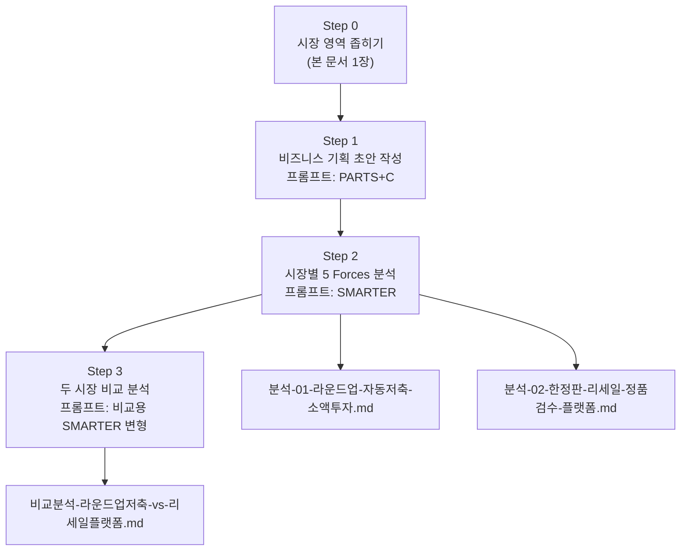

# 분석 방법론 — Porter's Five Forces 2개 시장 비교 분석

> 본 문서는 `Porter's Five Forces 분석 보고서 작성 실습` 과제의 **방법론 기록**입니다.
> 어떤 시장을 왜 골랐고, 어떤 프롬프트로 어떤 산출물을 뽑았는지를 재현 가능한 형태로 남깁니다.

---

## 1. 분석 대상 시장 선정

### 1-1. 선정 원칙 (`주의` 지침 반영)

과제의 `주의` 지침은 다음과 같습니다.

> 시장 영역 명칭을 예시 리스트에 있는 그대로 쓰지 말고, **더 구체적인 관심사를 적용해 좁힌 후** 분석한다.
> ex) 소셜미디어 플랫폼 X → 이미지 & 숏폼 영상 중심의 SNS O
>     자동차 산업 X → 미래형 수소 배터리 전기차 산업 O

따라서 아래 3가지 축으로 시장을 좁혔습니다.

1. **고객 축** — 누구의 문제인가 (연령·소득·니즈 단계)
2. **기능 축** — 어떤 행동을 대신해 주는가 (저축/투자, 검수/거래)
3. **구조 축** — 돈과 물건이 어떤 경로로 흐르는가 (예치·정산 구조)

### 1-2. 좁히기 결과

| 예시 리스트의 산업 분야 | 예시 리스트의 시장 영역 (그대로 쓰면 ❌) | 본 과제에서 분석할 시장 영역 (✅) |
| --- | --- | --- |
| 서비스 및 기타 | 은행 및 금융 서비스 (KB국민은행, 카카오뱅크) | **20~30대 사회초년생 대상 '잔돈 라운드업' 자동저축·소액 분산투자 특화 디지털 금융 서비스** |
| 소매 및 소비재 | 온라인 쇼핑몰 (쿠팡, 아마존) | **정품검수 기반 한정판 스니커즈·명품 리세일 C2C 플랫폼** |

**좁히기 과정 상세**

- 은행 및 금융 서비스 → (고객) 자산이 적고 금융 경험이 없는 사회초년생 → (기능) 의사결정 없이 자동으로 모이는 저축·투자 → (구조) 결제 잔돈을 반올림해 예치·운용
  → **"잔돈 라운드업 자동저축·소액 분산투자 서비스"**
- 온라인 쇼핑몰 → (고객) 리셀 시세에 민감한 스니커헤드·명품 소비자 → (기능) 개인 간 거래의 가짜 리스크 제거 → (구조) 플랫폼이 물건을 중간에 받아 검수 후 전달, 대금은 에스크로
  → **"정품검수 기반 한정판 리세일 C2C 플랫폼"**

### 1-3. 이 두 시장을 짝지은 이유

두 시장은 **"남의 돈이 플랫폼을 경유한다"**는 공통점을 가지면서, **진입 장벽의 성격이 정반대**입니다.

- 라운드업 금융: 장벽이 **외부에서 주어짐** (전자금융업 등록, 투자중개·일임 관련 인가, 자본금 요건, 마이데이터 허가 등)
- 리세일 플랫폼: 장벽을 **스스로 만들어야 함** (검수 역량, 검수센터·물류 CAPEX, 양면 네트워크)

같은 5가지 힘 프레임을 대입했을 때 **"규제가 만든 장벽"과 "운영역량이 만든 장벽"이 수익성에 어떻게 다르게 작용하는지** 비교할 수 있어 선정했습니다.

---

## 2. 분석 절차 및 산출물 맵



| 단계 | 사용 프롬프트 | 산출물 파일 |
| --- | --- | --- |
| Step 0 | — (수동 좁히기) | `분석-방법론.md` (본 문서) |
| Step 1 | PARTS+C — 비즈니스 기획 초안 | 기획 초안(임시 사용, 별도 파일 미보관) |
| Step 2 | SMARTER — 5 Forces 분석 ×2 | `분석-01-….md`, `분석-02-….md` |
| Step 3 | 비교 분석 프롬프트 | `비교분석-….md` |

> **왜 Step 1을 거치는가**
> 교안의 `기획 초안 첨부 vs 미첨부` 비교 예제가 보여주듯, 기획 초안을 컨텍스트로 넣으면 5 Forces 분석의 **구체성과 실행 가능성이 크게 올라갑니다.** 초안 없이 분석하면 "일반적인 금융 시장 분석"이 나오고, 초안을 넣으면 "우리 서비스가 이 시장에서 어디에 서야 하는지"가 나옵니다.
> 단, 이 초안은 **임시 문서**이며 최종 서비스 정의와는 달라질 수 있습니다.

---

## 3. Step 1 프롬프트 — 비즈니스 기획 초안 작성 (PARTS+C)

### 3-1. 시장 A: 잔돈 라운드업 자동저축·소액투자 서비스

```yaml
Persona : 당신은 전문 비즈니스 기획자이다. 당신은 고도한 비즈니스 감각을 갖추고 있으며, 사업적으로 중요한 부분에 대해서 명시적으로 언급되지 않고 암시적으로 제시되는 부분까지 빠짐없이 파악하고 그것을 요약적으로 제시하는 최고 수준의 문서화 능력을 가지고 있다.

Aim : 당신이 지금 작업할 내용은 아래 Context 섹션에 제시된 내용과 맥락을 기반으로 "잔돈 라운드업 자동저축·소액 분산투자 서비스"를 제작 및 운영하기 위한 비즈니스 기획서의 초안을 작성하는 것이다. 아래 Context 섹션에 제시된 자료의 명세는 "사회초년생 저축·투자 행동 관찰 메모 및 국내 디지털 금융 서비스 기능 비교표"와 같다. 이와 같은 구체적인 맥락과 콘텐츠 방향성을 기반으로 사업 계획의 아웃라인을 작성하라.

Reciepients : 대상 독자는 후속 비즈니스 분석을 수행할 사업 기획자 또는 경영자, 비즈니스 분석에 특화된 AI 에이전트 등이다.

Theme : 작성할 비즈니스 기획서의 기본 방향은, 이것이 비즈니스를 설계하는 극초반 단계의 문서라는 것을 염두에 두고 다양한 사업적 선택 방향에 대해서 아직 열려있다는 것을 전제하는 것이다. 예를 들면, 기획하고 있는 사업 주제 및 유형에 적합한 수익구조(BM)의 종류를 여러가지 제시해주고, 관련 사업 및 서비스에는 어떤 것들이 있는지 예시도 함께 제시해 주는 등이다. 특히 이 사업은 고객의 자금을 예치·운용하는 구조이므로, 필요한 인허가 유형과 자금 관리 방식의 선택지를 함께 열어두고 제시하라.

Structure : 비즈니스 기획서는 "Business One-Pager" 형태로 작성하고, 추가로 작성할 내용이 있다면 문서의 구성을 확장하라. 개조식으로 작성하되, 정확한 의미전달을 위해서 완전한 문장이 필요한 곳에는 반드시 완전한 문장을 사용해야 한다. 예의바른 어미를 사용하되, 절대로 내용 전달에 불필요한 단어를 추가하면서까지 예의를 차리지는 말아야 한다.

Context :
- 타깃 고객 : 사회초년생(만 23~32세), 월 소득 200~300만원대, 목돈은 없고 저축 습관도 없음. "저축해야 한다는 건 아는데 남는 돈이 없다"고 말하는 집단.
- 관찰된 행동 :
  - 적금은 "매달 정해진 금액을 넣어야 한다"는 부담 때문에 3개월 내 해지하는 경우가 많음.
  - 반대로 커피·배달 등 소액 결제는 하루에도 여러 번 아무 저항 없이 발생함.
  - 투자에 관심은 있으나 종목 선택에 대한 두려움이 커서 시작 자체를 못 함.
- 핵심 가설 : "결정을 요구하지 않는 저축·투자"만이 이 집단에서 살아남는다. 카드 결제가 발생할 때마다 1,000원 단위로 반올림한 잔돈을 자동으로 떼어 모으고, 일정 금액이 쌓이면 분산 상품에 자동 편입한다.
- 기존 서비스 참고 : 카카오뱅크 '저금통', 토스 자동저축·목표 저축, 해외의 Acorns(라운드업 투자 + 월정액 구독), 각 증권사의 소수점 거래 기능.
- 열어둘 논점 : 예치금의 법적 성격(예금/선불충전금/투자자예탁금 중 무엇으로 설계할지), 필요 인허가 조합, 제휴 방식(직접 라이선스 취득 vs 은행·증권사 제휴), 수익 모델(월정액 구독 / 예치 잔액 기반 수수료 / 제휴 리퍼럴 / 프리미엄 리포트).
---
자 그럼 이제 작업을 시작하자.
```

### 3-2. 시장 B: 정품검수 기반 한정판 리세일 C2C 플랫폼

```yaml
Persona : 당신은 전문 비즈니스 기획자이다. 당신은 고도한 비즈니스 감각을 갖추고 있으며, 사업적으로 중요한 부분에 대해서 명시적으로 언급되지 않고 암시적으로 제시되는 부분까지 빠짐없이 파악하고 그것을 요약적으로 제시하는 최고 수준의 문서화 능력을 가지고 있다.

Aim : 당신이 지금 작업할 내용은 아래 Context 섹션에 제시된 내용과 맥락을 기반으로 "정품검수 기반 한정판 스니커즈·명품 리세일 C2C 플랫폼 서비스"를 제작 및 운영하기 위한 비즈니스 기획서의 초안을 작성하는 것이다. 아래 Context 섹션에 제시된 자료의 명세는 "한정판 리세일 거래 사기 유형 정리 및 국내 리세일 플랫폼 수수료·검수 정책 비교표"와 같다. 이와 같은 구체적인 맥락과 콘텐츠 방향성을 기반으로 사업 계획의 아웃라인을 작성하라.

Reciepients : 대상 독자는 후속 비즈니스 분석을 수행할 사업 기획자 또는 경영자, 비즈니스 분석에 특화된 AI 에이전트 등이다.

Theme : 작성할 비즈니스 기획서의 기본 방향은, 이것이 비즈니스를 설계하는 극초반 단계의 문서라는 것을 염두에 두고 다양한 사업적 선택 방향에 대해서 아직 열려있다는 것을 전제하는 것이다. 예를 들면, 기획하고 있는 사업 주제 및 유형에 적합한 수익구조(BM)의 종류를 여러가지 제시해주고, 관련 사업 및 서비스에는 어떤 것들이 있는지 예시도 함께 제시해 주는 등이다. 특히 이 사업은 판매자의 대금을 플랫폼이 일시 보관한 뒤 정산하는 구조이므로, 대금 보관·정산 방식의 선택지를 함께 열어두고 제시하라.

Structure : 비즈니스 기획서는 "Business One-Pager" 형태로 작성하고, 추가로 작성할 내용이 있다면 문서의 구성을 확장하라. 개조식으로 작성하되, 정확한 의미전달을 위해서 완전한 문장이 필요한 곳에는 반드시 완전한 문장을 사용해야 한다. 예의바른 어미를 사용하되, 절대로 내용 전달에 불필요한 단어를 추가하면서까지 예의를 차리지는 말아야 한다.

Context :
- 거래 대상 : 발매 즉시 품절되는 한정판 스니커즈, 시즌 한정 명품 잡화 등 정가보다 높은 가격에 재거래되는 상품군.
- 시장의 근본 문제 : 개인 간 직거래에서 (1) 가짜 판별 불가 (2) 대금 선입금 후 미배송 (3) 상품 상태 분쟁이 반복 발생함. 즉 이 시장의 병목은 물류가 아니라 신뢰이다.
- 핵심 가설 : 플랫폼이 거래 중간에 물건을 물리적으로 받아 검수한 뒤 구매자에게 보내고, 대금은 검수 통과 시점까지 보관한다. 검수가 곧 상품이다.
- 기존 서비스 참고 : 네이버 크림(KREAM), 무신사 솔드아웃, 해외의 StockX·GOAT, 명품 전문의 발란·트렌비·머스트잇.
- 관찰된 시장 이력 : 후발 플랫폼들이 초기 점유율 확보를 위해 수수료 0% 및 배송비 무료 정책을 장기간 유지했고, 이후 수수료를 단계적으로 인상하는 과정에서 사용자 이탈과 반발이 발생했다. 명품 카테고리에서는 판매자 정산 지연이 플랫폼 신뢰 붕괴로 직결된 사례가 있었다.
- 열어둘 논점 : 검수 범위(전 카테고리 vs 고가 카테고리 한정), 검수센터 직영 vs 외주, 수익 모델(거래 수수료 / 검수 수수료 별도 과금 / 보관 서비스 / 시세 데이터 판매 / 광고), 판매 대금 보관·정산 방식과 정산 주기.
---
자 그럼 이제 작업을 시작하자.
```

---

## 4. Step 2 프롬프트 — Porter's Five Forces 분석 (SMARTER)

아래 프롬프트를 **시장 A와 시장 B에 각각 1회씩, 총 2회** 실행합니다.
`[분석 대상 시장 영역]` 자리에 3장에서 만든 기획 초안과 시장 명칭을 넣습니다.

```markdown
S: Situation (상황)
당신은 하버드 비즈니스 스쿨 출신의 최고 수준 경영 컨설턴트입니다. 저는 특정 산업의 구조적인 매력도와 수익성을 평가하여 비즈니스 전략 수립이나 투자 결정을 내리고자 합니다. 이를 위해 가장 신뢰도 높은 분석 프레임워크 중 하나인 마이클 포터의 '5가지 힘 모델'을 사용하려고 합니다.

M: Mission (목표)
[분석 대상 시장 영역] 시장에 대해 포터의 5가지 힘 모델을 적용하여, 각 요소를 심층적으로 분석하고 이를 바탕으로 해당 시장의 전반적인 경쟁 강도와 잠재적 수익성을 평가하는 종합적인 보고서를 작성하는 것이 목표입니다.

A: Action Steps (단계별 수행)
신규 진입자의 위협 (Threat of New Entrants): 진입 장벽(규모의 경제, 브랜드 충성도, 자본 요구량, 규제 등)을 평가하여 신규 경쟁자의 진입 가능성이 얼마나 높은지 분석해 주세요.

기존 경쟁자 간의 경쟁 (Rivalry Among Existing Competitors): 시장 내 경쟁자 수, 산업 성장률, 제품 차별화 수준 등을 고려하여 기존 기업 간의 경쟁이 얼마나 치열한지 분석해 주세요.

구매자의 교섭력 (Bargaining Power of Buyers): 구매자의 집중도, 가격 민감도, 제품의 표준화 정도, 전환 비용 등을 기반으로 구매자가 가격과 품질에 미치는 영향력을 분석해 주세요.

공급자의 교섭력 (Bargaining Power of Suppliers): 공급자의 집중도, 공급하는 자원의 중요성 및 대체 가능성 등을 바탕으로 공급자가 기업의 수익성에 얼마나 큰 영향력을 행사하는지 분석해 주세요.

대체재의 위협 (Threat of Substitutes): 시장의 제품이나 서비스를 대체할 수 있는 다른 산업의 상품이나 서비스가 존재하는지, 그리고 그 대체재의 가격 및 성능 매력도를 분석해 주세요.

종합 결론: 위 5가지 힘을 종합하여 [분석 대상 시장 영역] 시장의 전반적인 매력도(높음, 중간, 낮음)와 잠재적 수익성에 대한 최종 결론을 도출해 주세요.

R: Result (결과)
제목: "[분석 대상 시장 영역] 시장에 대한 포터의 5가지 힘 분석"

형식: 각 5가지 힘을 개별 소제목으로 구분하여 명확하게 나누어 주세요.

내용: 각 힘에 대해 '강함', '중간', '약함'으로 강도를 명시하고, 그렇게 판단한 핵심 근거를 2~3가지 이상 불릿 포인트(-)로 제시해 주세요.

마무리: 마지막에 "종합 결론" 섹션을 추가하여 전체 분석을 요약하고 시장의 매력도에 대한 최종 의견을 제시해 주세요.

T: Tone&Style (톤과 스타일)
어조: 객관적이고 분석적인 전문가의 어조를 유지해 주세요.

스타일: 복잡한 용어보다는 명확하고 이해하기 쉬운 비즈니스 용어를 사용해 주세요. 데이터나 사실에 기반한 논리적인 설명을 제시해 주세요.

E: Example (예시)
만약 '국내 커피 전문점 시장'을 분석한다면, 결과는 다음과 같은 형식이어야 합니다.

3. 구매자의 교섭력: 강함
스타벅스, 투썸플레이스 등 경쟁 브랜드가 많아 소비자의 선택 폭이 넓다.
브랜드 간의 이동에 따르는 전환 비용이 거의 없다.
개인 카페, 편의점 커피 등 저렴한 대체재가 많아 가격 민감도가 높다.

R: Resource (자료)
[Step 1에서 작성한 해당 시장의 비즈니스 기획 초안 전문을 여기에 첨부합니다. 자료가 제공될 경우, 해당 내용을 우선적으로 분석에 반영해 주세요. 단, 기획 초안은 가설 단계의 문서이므로 시장 구조에 대한 판단은 초안의 주장에 종속되지 않고 독립적으로 내려 주세요.]
```

**시장별 치환 값**

| 항목 | 시장 A | 시장 B |
| --- | --- | --- |
| `[분석 대상 시장 영역]` | 사회초년생 대상 잔돈 라운드업 자동저축·소액 분산투자 서비스 | 정품검수 기반 한정판 스니커즈·명품 리세일 C2C 플랫폼 |
| `R: Resource` 첨부물 | 3-1 프롬프트로 생성한 기획 초안 | 3-2 프롬프트로 생성한 기획 초안 |
| 산출물 | `분석-01-라운드업-자동저축-소액투자.md` | `분석-02-한정판-리세일-정품검수-플랫폼.md` |

---

## 5. Step 3 프롬프트 — 두 시장 비교 분석

Step 2의 두 보고서를 **모두 컨텍스트로 넣고** 아래 프롬프트를 1회 실행합니다.

```markdown
S: Situation (상황)
당신은 하버드 비즈니스 스쿨 출신의 최고 수준 경영 컨설턴트입니다. 저는 서로 다른 두 개의 시장 영역에 대해 이미 포터의 5가지 힘 분석을 각각 완료했습니다. 이제 두 분석 결과를 나란히 놓고, 두 시장의 구조적 차이가 전략적으로 무엇을 의미하는지 판단하고자 합니다.

M: Mission (목표)
아래 Resource로 제공되는 두 개의 5 Forces 분석 보고서를 비교하여, 두 시장의 구조적 차이점과 공통점을 명확히 하고 각 시장의 핵심 성공 요인(KSF)을 도출하는 2차 보고서를 작성하는 것이 목표입니다. 두 시장 중 어느 쪽이 더 매력적인지에 대한 판단과 그 근거도 반드시 포함해 주세요.

A: Action Steps (단계별 수행)
1. 5가지 힘 각각에 대해 두 시장의 강도(강함/중간/약함)를 나란히 제시하고, 그 차이가 '명확한 차이'인지 '공통점'인지 분류해 주세요.
2. 5가지 힘별로 심층 비교 분석을 수행해 주세요. 특히 같은 강도로 평가되었더라도 그 원인이 다른 경우에는 그 차이를 반드시 드러내 주세요.
3. 두 시장의 구조적 차이를 만들어내는 '가장 결정적인 힘'이 무엇인지 지목하고 그 이유를 설명해 주세요.
4. 각 시장에서 살아남기 위한 전략 방향을 서로 대비되도록 제시해 주세요.

R: Result (결과)
제목: "[시장A] vs [시장B] 비교 분석 보고서 (포터의 5가지 힘 모델 기반)"

형식: (1) 개요 (2) 주요 힘 비교 요약 표 (3) 세력별 심층 비교 분석 (4) 종합 결론 및 전략적 시사점 순서로 작성해 주세요.

내용: 비교 요약 표에는 5가지 힘 + 종합 매력도 행을 모두 포함하고, 각 행마다 '핵심 차이점 및 공통점' 열을 두어 [명확한 차이] 또는 [공통]으로 태그를 붙여 주세요.

T: Tone&Style (톤과 스타일)
어조: 객관적이고 분석적인 전문가의 어조를 유지해 주세요.
스타일: 두 시장의 대비가 직관적으로 이해되도록, 각 시장의 전략 방향에 짧은 비유적 명명(예: '성벽 강화형', '깃발 꽂기형')을 부여해 주세요. 단 비유가 분석의 근거를 대체해서는 안 됩니다.

R: Resource (자료)
[보고서 1] 분석-01-라운드업-자동저축-소액투자.md 전문
[보고서 2] 분석-02-한정판-리세일-정품검수-플랫폼.md 전문
```

**산출물**: `비교분석-라운드업저축-vs-리세일플랫폼.md`

---

## 6. 분석 시 유의사항 (기록용)

- **강도 판정의 기준을 통일할 것** — 두 보고서에서 '강함'의 의미가 달라지면 비교 표가 무의미해집니다. 본 과제에서는 "해당 힘이 산업 평균 수익률을 깎아내리는 정도"를 기준으로 통일했습니다.
- **구매자를 반드시 쪼갤 것** — 두 시장 모두 양면 시장(라운드업: 사용자·제휴 금융사 / 리세일: 구매자·판매자)이므로, '구매자'를 한 덩어리로 보면 교섭력 판단이 뭉개집니다.
- **규제는 진입 장벽이자 비용** — 금융 시장에서 규제는 신규 진입자를 막아주는 방패이지만, 동시에 기존 사업자의 고정비를 끌어올리는 요인입니다. 두 방향을 모두 서술했습니다.
- **수치는 검증된 것만 사용할 것** — 시장 규모·점유율 수치는 출처 없이 단정하지 않고, 구조적 근거와 공개적으로 알려진 사례 위주로 서술했습니다.
