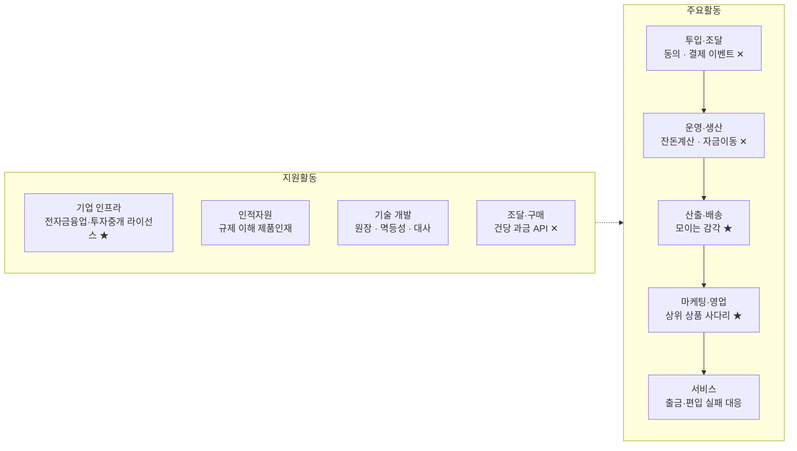

# 가치사슬 분석 ① — 잔돈 라운드업 자동저축·소액 분산투자 서비스

> [분석 방법론](./분석-방법론.md) · 선행 분석 [Five Forces ①](../01-porters-five-forces/분석-01-라운드업-자동저축-소액투자.md)

## 0. 분석 단위와 방법론 적용 방식

| 항목 | 설정 |
|---|---|
| 분석 주체 | 카드 결제 잔돈을 자동 예치·상품 편입하는 **디지털 금융 서비스 사업자** |
| 타깃 고객 | 만 23~32세 사회초년생. 목돈과 저축 습관이 모두 없는 집단 |
| 수익 모델 | 예치 잔액 기반 수수료 중심, 일부 월정액 구독·제휴 리퍼럴 |
| 지역·시점 | 국내, 2026년 현재 |

> 📎 **방법론 적용 메모.** 방법론의 질문표는 금융 플랫폼 기준으로 쓰여 있어 이 사업에는 거의 그대로 적용된다. 다만 이 사업의 특수성은 **"건당 금액이 극도로 작은 거래가 대량으로 발생한다"**는 데 있다. 따라서 각 질문을 답할 때 *"이 활동의 원가가 건수에 비례하는가, 잔액에 비례하는가"*를 함께 판정한다. 예: *"거래량이 급증해도 안정적으로 처리할 수 있는가"* → 이 사업에서는 **처리 안정성 문제가 아니라 건당 원가 문제**로 나타난다.

### 전체 가치사슬 개요



★ = 차별화가 만들어지는 활동 · ✕ = **실행 주체가 외부인 활동**

> 📌 **개요에서 이미 드러나는 것.** 5개 주요활동 중 앞의 두 개, 그리고 원가의 본체인 조달까지 ✕(외부 실행)가 붙는다. **가치사슬의 앞단이 통째로 남의 것**이라는 사실이 이 분석의 결론을 미리 규정한다.

---

## 1. 주요활동 분석

### 1-1. 투입·조달 물류 (Inbound Logistics)
**동의·결제 이벤트·금융 연결자원 확보**

| 가치사슬 **설계**를 위한 질문 🏗️ | 가치사슬 **개선**을 위한 질문 🚀 |
| --- | --- |
| • 핵심 투입자원은 무엇인가? → **고객 동의(전송요구권), 결제 이벤트 스트림, 출금이체 권한, 편입 대상 상품, 예치 계좌** 다섯 가지<br>• 고객 동의 기반 금융데이터를 어떻게 확보할 것인가? → 마이데이터 정기·수시전송, 카드사 제휴, 오픈뱅킹 조회 중 선택. **동의 획득 실패가 곧 가입 실패**다<br>• 금융회사와 어떤 방식으로 연결할 것인가? → 계좌·상품·체결을 제휴로 받을지, 직접 라이선스로 내부화할지가 첫 갈림길<br>• 무엇을 자체 확보하고 무엇을 외부에서 살 것인가? → **잔돈 계산 규칙·행동 데이터·예치 원장은 자체**, 본인확인·출금이체·매매 체결은 외부. 즉 **자금이 실제로 움직이는 모든 구간이 외부**<br>• 고객정보를 어떻게 수집·정제·표준화할 것인가? → 결제 금액·시각만으로 잔돈 계산은 성립한다. 가맹점 상세는 개인화용 추가 수집<br>• 금융회사가 참여할 유인은 무엇인가? → 미거래 연령층 유입과 예치 잔액. **잔액이 작아 유인이 약하다** | • 외부 데이터의 정확성·최신성을 어떻게 높일 것인가? → 정기전송은 실시간이 아니라 "결제 직후 잔돈이 모였다"는 즉시성을 만들기 어렵다. **선반영 후 사후 정정** 구조 필요<br>• 특정 공급자 의존도를 줄일 수 있는가? → 제휴사 1곳에 계좌·상품·체결을 모두 의존하면 공급자 리스크가 그대로 실현된다. **복수 제휴 또는 직접 라이선스가 유일한 근본 대책**<br>• **외부 API 장애에 대비한 대체 경로가 있는가?** → 조회 장애는 지연 큐로 흡수 가능하나, 출금 장애는 다르다. **멱등키 없이는 중복 출금이 발생한다**<br>• 데이터를 어떻게 되먹일 것인가? → (a) 잔돈 발생량 예측 (b) 이탈 예측 (c) 상위 상품 추천<br>• 중복 수집되는 고객정보를 줄일 수 있는가?<br>• 최소수집과 개인화의 균형을 어떻게 설계할 것인가? → **동의 항목이 늘면 가입 이탈이 커진다**는 교환관계로 판단 |

> 📌 **Five Forces 연결.** ①번 분석에서 공급자 교섭력을 '강함'으로 판정한 원인(제휴 금융사·마이데이터 인프라·카드사·클라우드)이 **전부 이 활동과 조달 활동에 몰려 있다.** 더구나 이 공급자는 동일 기능을 자사 앱에 붙일 수 있는 **잠재적 경쟁자를 겸한다.**

> 📊 **측정 지표.** 동의 완료율 · 데이터 수신 지연(P95) · 외부 API 가용률 · 계정 연결 성공률

### 1-2. 운영·생산 (Operations)
**잔돈을 실제 예치·투자로 변환 — 이 사업의 원가가 결정되는 구간**

```
가입 → 본인확인(KYC/CDD) → 카드·계좌 연결 → 라운드업 규칙 설정
  → [결제 발생] → 잔돈 계산 → 출금이체 → 예치
  → 임계금액 도달 → 상품 편입(매수) → 체결·정산 → 원장 반영 → 결과 안내
```

| 설계 🏗️ | 개선 🚀 |
| --- | --- |
| • 고객 요청을 금융 가치로 바꾸는 핵심 처리는 무엇인가? → 위 흐름. 특징은 **금액은 수백 원인데 처리 비용은 금액과 무관하게 건당 발생**한다는 것<br>• **가장 중요한 설계 결정은 "언제 모아서 옮기는가"다.** → 결제마다 즉시 출금하면 건당 원가가 예치금액을 초과한다. **잔돈은 앱 내 원장에만 즉시 적립하고, 실제 자금 이동은 1일 1회 또는 임계금액 도달 시 합산 처리**하는 것이 사실상 유일한 해법<br>• 예치금을 어떤 법적 성격으로 설계할 것인가? → 선불충전금이면 별도관리 의무, 투자자예탁금이면 투자중개 라이선스와 손실 고지 의무가 붙는다. **이 결정이 운영 전체를 규정한다**<br>• 인증·AML·소비자보호를 어떻게 수행할 것인가? → KYC/CDD, STR·CTR 기준 적용, 접근매체 관리<br>• 거래량이 급증해도 안정적으로 처리할 수 있는가? → 기술적 처리량보다 **건당 원가의 급증**이 실제 위험<br>• 자동화와 수동 심사의 경계는? → 자동을 기본으로, **고위험 판정 시에만 수동 라우팅** | • 전환율을 어떻게 높일 것인가? → 최대 이탈 지점은 가입이 아니라 **본인확인·계좌 연결 단계**다. 잔돈 저축이라는 가벼운 동기에 신분증 촬영은 과도한 마찰<br>• → **단계 분할**: 먼저 잔돈 계산 결과만 보여주고, 실제 예치 직전에 인증 요구<br>• 처리시간·오류율·수동처리 비율을 줄일 수 있는가? → 출금 묶음 주기 최적화, 잔액부족 시 무한 재시도 금지, 편입 주문 배치화<br>• **정산·대사를 자동화할 수 있는가?** → 소액 다건에서 오차가 누적되면 원인 추적이 불가능해진다. 일별 자동 대사와 불일치 자동 격리는 **민원을 사전에 제거하는 최고 효율의 투자**<br>• 부정거래 탐지율을 높이며 오탐을 줄일 수 있는가? → 소액 반복 출금은 이상거래 룰에 걸리기 쉽다. **정상 라운드업 패턴 화이트리스트화**<br>• 빠른 배포와 안정성을 동시에? → **자금 로직과 UI 로직의 배포 분리** |

> ⚠️ **이 사업 특유의 부담.** 일반 금융 서비스는 "거래 금액이 크고 건수가 적다". 이 사업은 정반대다. 그래서 다른 금융 서비스에서 부차적인 **건당 수수료(출금이체·본인확인·체결)가 여기서는 손익을 결정한다.** 커피 한 잔의 잔돈 300원을 옮기는 데 건당 수수료가 붙으면 그 거래는 즉시 적자다.

> 📊 **측정 지표.** 출금 성공률 · **건당 처리원가** · 자동 편입 체결률 · 일별 대사 불일치 건수 · 수동처리 비율 · 인증 완주율

### 1-3. 산출·배송 물류 (Outbound Logistics)
**"모이고 있다"는 감각의 전달**

| 설계 🏗️ | 개선 🚀 |
| --- | --- |
| • 고객은 결과를 어떤 채널로 받는가? → 앱 홈(누적 현황), 푸시(이벤트), 이메일·문서(법정 통지·거래내역)<br>• 어떤 형식으로 보여줄 것인가? → **이 서비스의 산출물은 돈이 아니라 진척감이다.** 실제 금액이 작으므로 금액만 보여주면 실망한다. 누적액·목표 달성률·절약 환산이 핵심 산출물<br>• 고객이 다음 행동을 즉시 이해할 수 있는가?<br>• 채널 역할을 어떻게 구분할 것인가? → 푸시는 예치 완료·편입 완료·출금 실패만<br>• **금융상품의 비용과 위험을 충분히 설명할 수 있는가?** → 원금 손실 가능성·수수료·세금은 편입 전 고지. **UX 선택이 아니라 규제 요건** | • 결과를 더 빠르고 정확하게 이해하게 할 수 있는가?<br>• 핵심 정보와 부가정보의 우선순위가 명확한가? → 상단은 누적액, 수익률은 그 다음<br>• 지연·장애 시 상태를 안내할 수 있는가? → "출금 실패"에서 멈추지 않고 **원인과 재시도 시점**까지<br>• **중복·과도한 알림을 줄일 수 있는가?** → 결제마다 알림을 보내면 하루 수 회 푸시가 발생해 **앱 삭제 사유**가 된다. 일 1회 요약 + 실패만 즉시<br>• 취약계층의 이해 가능성을 높일 수 있는가? → 투자 용어 최소화. 손실 표시는 손실률 단독이 아니라 **투입 원금·기간과 함께** |

> 📌 **여기가 A의 유일한 유리 구간.** 산출물이 화면과 숫자이므로 한 명에게 더 보여주는 한계비용이 0이다. 앞단·조달에서 새는 원가와 달리 **이 활동만은 규모의 경제가 완벽하게 작동한다.**

> 📊 **측정 지표.** 알림 수신 후 앱 진입률 · 알림 차단·삭제율 · 설명 고지 확인율 · 손실 구간 이탈률

### 1-4. 마케팅 및 영업 (Marketing & Sales)

| 설계 🏗️ | 개선 🚀 |
| --- | --- |
| • 핵심 고객은 누구인가? → 개인고객이지만 **실질적으로 제휴 금융사도 고객**이다. 개인에게는 "결정하지 않아도 모인다", 금융사에게는 "접근 못하던 연령층을 데려온다"<br>• 고객이 이 서비스를 써야 하는 핵심 이유는? → 절약이 아니라 **자동성**. 그런데 같은 결과를 주는 무료 대체재(적금 자동이체, 증권사 자동매수)가 이미 있다<br>• **저축 고객을 자산관리·투자로 어떻게 연결할 것인가?** → **사다리 설계가 이 사업의 유일한 수익 경로다.** 라운드업 → 목적자금 → 연금·포트폴리오<br>• 신뢰·안전을 어떻게 전달할 것인가? → 예치금 보관 구조와 손실 가능성의 정직한 표시<br>• 채널 역할은? → 유료 광고는 CAC 대비 LTV가 맞지 않아 사실상 불가. **제휴 채널·콘텐츠·리퍼럴 중심** | • **CAC를 낮추고 LTV를 높일 수 있는가?** → 잔액이 작은 고객의 LTV는 낮다. **상위 상품 전환율을 LTV의 핵심 변수로 관리**하고, 전환되지 않는 고객군에는 유료 획득비를 쓰지 않는 규율 필요<br>• 프로모션 종료 후에도 남는가? → 캐시백 유입 고객은 종료 시 이탈한다. **연속 예치 주수를 유입 성과 지표로 대체**<br>• 교차 이용률을 어떻게 높일 것인가?<br>• 개인화 추천이 실제 편익으로 이어지는가?<br>• **이해상충을 어떻게 관리할 것인가?** → 편입 상품 추천이 수수료 높은 상품으로 기울면 신뢰가 붕괴한다. 추천 근거·수수료 구조 공개가 장기 자산<br>• 리퍼럴이 장기 고객으로 전환되는가? → 함께 모으기·목표 공유는 이 시장에서 CAC를 낮추는 몇 안 되는 수단 |

> ⚠️ **지불 이유의 부재.** 이 활동의 근본 문제는 예산이 아니라 **팔 이유가 약하다는 것**이다. 차별점인 "자동성"을 대형 금융 앱이 무료로 제공하므로, 마케팅은 *다른 활동이 만들지 못한 가치를 대신 메우려는 시도*가 되기 쉽다. **이 구조에서는 마케팅비를 늘려도 잔존율이 오르지 않는다.**

> 📊 **측정 지표.** CAC · 12개월 잔존율 · **상위 상품 전환율** · 연속 예치 유지 주수 · 리퍼럴 계수

### 1-5. 서비스 (Service)
**거래 이후 지원과 고객보호**

| 설계 🏗️ | 개선 🚀 |
| --- | --- |
| • 어떤 문제를 처리해야 하는가? → **출금 실패(잔액부족), 이중 출금 의심, 자동 편입 미실행, 해지·전액 인출, 세금·수익률 문의**. 이중 출금 의심은 소액 다건 구조에서 필연적으로 발생<br>• 고객이 스스로 해결할 수 있는 기능은? → 거래 내역 상세, **라운드업 일시정지**, 전액 인출, 규칙 변경. *일시정지를 쉽게 제공하는 것이 해지를 막는 최선의 장치*<br>• 자동상담과 상담원의 경계는? → 금융상품 질의는 **투자 권유로 해석될 위험**이 있어 자동응답 범위를 엄격히 제한<br>• 금융사고 시 조사·보상·신고·재발방지를 어떻게 수행할 것인가? → 절차 사전 문서화. **제휴사와의 책임 분담 조항이 결정적**<br>• VOC를 제품 개선으로 연결하는 체계가 있는가? | • 반복 문의를 제품으로 제거할 수 있는가? → "왜 이번 주엔 안 모였나요"류는 화면에 이유(결제 없음/출금 실패/일시정지)를 표시하면 사라진다<br>• **문의 전에 탐지할 수 있는가?** → 출금·편입 실패는 시스템이 먼저 안다. 묻기 전에 알리면 문의량 자체가 줄어든다<br>• **AI 상담의 금융 오안내를 어떻게 방지할 것인가?** → 수익률 전망·상품 추천은 **AI 응답 금지 영역**으로 지정하고 해당 의도 감지 시 즉시 상담원 이관<br>• 처리시간이 아니라 실제 해결률을 보는가? → **재문의율**을 핵심 지표로<br>• 민원 원인을 분류할 수 있는가? → 제휴사 장애 / 자체 시스템 / UX 오해 / 정책 / 상품 성과 |

> 📊 **측정 지표.** 문의율(건/천 고객) · 재문의율 · 문의 전 사전안내율 · 일시정지 후 복귀율 · 해지 사유 분포

---

## 2. 지원활동 분석

| 활동 | 설계 🏗️ | 개선 🚀 |
| --- | --- | --- |
| **기업 인프라**<br>Firm Infrastructure | • **기능 하나가 곧 라이선스 하나다.** 잔돈을 미리 받아 보관하면 전자금융업(선불전자지급수단 등), 상품에 편입하면 투자중개·일임, 결제 내역을 읽으면 마이데이터 영역<br>• → **어디까지 직접 취득하고 어디부터 제휴할지가 사업 구조의 첫 결정**<br>• 조직: 리스크관리·준법감시·정보보호·내부감사는 규모와 무관하게 필요하며 **초기 고정비의 큰 부분**을 차지<br>• 반영할 규제: 개인신용정보, 금융소비자보호(설명의무·부당권유 금지), 고객 자금 별도 관리, 접근매체 관리<br>• 신규 기능의 법률·보안·리스크 검토를 **개발 착수 전**에 배치 | • **제휴사와의 책임 경계가 문서화되어 있는가?** → 오출금·손실 시 누가 고객에게 답하는지 사전에 정해두지 않으면 사고 시점에 대응이 멈춘다<br>• 성장지표와 리스크지표가 충돌할 때 기준은? → "전환율을 위해 인증 단계를 줄이자"는 요구는 상시 발생. **우선순위 원칙의 명문화**<br>• 준법·보안이 설계 초기부터 참여하는가?<br>• 사고 대응 지휘체계와 보고 라인이 단일한가? |
| **인적자원 관리**<br>HRM | • 필요 인재: 결제·정산 도메인 백엔드, 금융 준법·리스크, 데이터 분석, 보안<br>• **가장 구하기 어려운 조합은 "규제를 이해하는 제품 담당자"**<br>• 금융 전문성과 제품 역량의 결합 방식 → 준법 담당자를 제품팀에 임베드하면 검토 지연이 가장 크게 줄어든다<br>• 자금 이동 로직의 최종 책임자를 명시적으로 지정 | • **소수 인력에 결제·정산 지식이 집중되어 있지 않은가?** → 대사 절차와 장애 런북의 문서화가 곧 인적 리스크 분산<br>• 성과평가가 안정성·고객보호(장애 건수, 민원율)를 반영하는가?<br>• 감독규정 개정을 추적하는 학습 체계가 있는가?<br>• 온콜 부담이 특정 인력에 쏠려 있지 않은가? |
| **기술 개발**<br>Technology Development | • **경쟁력을 만드는 기술은 화려한 것이 아니라 정확성이다.** → (a) 멱등성 보장 자금 이동 (b) 자동 대사 엔진 (c) 배치 스케줄러 (d) 원장(Ledger) 설계<br>• 자체 vs 외부 기준 → **차별화 요소는 자체**(잔돈 규칙·원장·습관 UX), 규격화된 것은 외부(본인확인·룰 엔진·알림 발송)<br>• AI 적용 우선순위 → 사기 탐지 > 이탈 예측 > 상담 보조. **상품 추천 AI는 규제 리스크로 후순위** | • 중복 개발을 줄이고 재사용률을 높일 수 있는가? → **원장·정산 모듈을 공통 플랫폼화**하면 상위 상품 확장 시 그대로 재사용<br>• 장애를 사전에 예측할 수 있는가? → 외부 API 응답 지연 추세로 사전 경보<br>• 배포속도와 거래 안정성을 동시에? → 자금 로직·표현 로직 분리 배포<br>• **생성형 AI의 금융정보 오류를 검증하는 체계가 있는가?** → 검증 게이트 없이 고객 대면 사용 금지 원칙 |
| **조달·구매**<br>Procurement | • 조달 항목: 클라우드, 본인확인(**건당 과금**), 출금이체·오픈뱅킹 이용료(**건당 과금**), 마이데이터 중계, 이상거래 탐지 솔루션, 알림 발송, 고객센터<br>• **이 사업에서 조달은 지원활동이 아니라 원가의 본체다.** 건당 과금 항목이 많고 건수가 극단적으로 많기 때문<br>• 공급자 평가에 보안·가용성·금융권 이용 적합성 포함<br>• 협상력을 어떻게 확보할 것인가? → 초기엔 없다. **계약을 볼륨 구간별 단가로 설계**해 성장에 따라 자동 인하되도록 미리 넣는 것이 유일한 수단 | • **단가 인하가 곧 이익률 개선이다.** 다만 단가 협상보다 **묶음 처리로 건수 자체를 줄이는 것이 효과가 크다**<br>• 단일 클라우드·단일 인증 공급자 종속 여부와 대안 확보<br>• 계약에 데이터 반환·삭제·보안감사·장애 배상 조건이 포함되는가?<br>• 공급자의 규제 준수 상태를 정기 점검하는가?(위탁 관리 의무) |

---

## 3. 종합 진단 — 가치는 어디서 만들어지고 어디서 새는가

| 구간 | 판정 | 근거 |
|---|---|---|
| 투입·조달 | 🔴 **가치 유출** | 데이터·연결·자격을 모두 외부에서 사온다. 협상력 없음 |
| 운영·생산 | 🔴 **가치 유출** | 가치가 발생하는 순간(자금 이동)의 실행 주체가 제휴 금융사 |
| 산출·배송 | 🟢 **가치 창출** | 복제 비용 0. "모이는 감각"은 우리 것이고 데이터가 쌓인다 |
| 마케팅·영업 | 🔴 **가치 유출** | CAC > LTV. 무료 대체재가 있어 지불 이유가 약하다 |
| 서비스 | 🟡 중립 | 잘하면 해지 방어, 못하면 이탈. 매출로는 연결되지 않음 |
| *(지원)* 기업 인프라 | 🔴 **비용 중심** | 진입 자격이지만 고객 수와 무관한 고정비 |
| *(지원)* 조달·구매 | 🔴 **가치 유출** | 건당 과금 단가를 남이 정한다 |

**핵심 진단 세 가지**

1. **가치사슬의 심장이 남의 것이다.** 고객을 데려오는 앞단(마케팅)과 경험을 만드는 뒷단(산출·서비스)은 우리 것이지만, **가치가 실제로 발생하는 자금 이동 구간은 제휴 금융사가 수행한다.** Five Forces에서 공급자 교섭력을 '강함'으로 판정한 것은 추상적 힘의 서술이 아니라 **핵심 활동을 남이 수행하고 있다는 사실의 다른 표현**이었다.

2. **매출과 원가가 서로 다른 것에 비례한다.** 매출은 예치 **잔액**(작음)에 비례하는데 변동비는 거래 **건수**(많음)에 비례한다. 잔돈 저축은 본질적으로 "금액은 작고 건수는 많은" 거래이므로, **이 두 곡선이 교차하지 않으면 사업이 성립하지 않는다.** 그래서 개선 1순위가 마케팅이 아니라 운영 활동의 묶음 처리가 된다.

3. **복제 불가능한 활동은 기술이 아니라 습관 데이터와 사다리다.** 잔돈 계산 로직은 몇 주면 복제된다. 남는 것은 **고객의 행동 데이터와 상위 상품으로 올려보내는 경로**뿐이다. 얕지만 유일한 방어선이며, 마침 둘 다 우리 것이다.

## 4. 개선 우선순위

| 순위 | 활동 | 조치 | 근거 |
|---|---|---|---|
| 1 | 운영·생산 | **자금 이동 묶음 처리로 건당 원가 절감** | 사업 성립 여부 자체를 결정. 개발 난이도 낮고 효과 즉시 |
| 2 | 투입·조달 / 기업 인프라 | **복수 제휴사 확보 또는 직접 라이선스** | 공급자 종속이 수익성 상한을 외부에 고정시킨다 |
| 3 | 운영·생산 | 인증·계좌연결 **단계 분할**로 완주율 개선 | 최대 이탈 구간. 즉시 효과 |
| 4 | 마케팅·영업 | **상위 상품 사다리 구축** | LTV 확보의 유일한 경로 |
| 5 | 기술 개발 | 대사·멱등성 체계 정비 | 민원과 사고를 발생 전에 제거 |
| 6 | 산출·배송 | 알림 정책 재편(일 1회 요약) | 삭제 사유 제거와 발송비 절감을 동시에 달성 |

> Five Forces가 내린 결론(**라운드업을 사업이 아니라 입구로 재정의**)을 가치사슬로 옮기면, 실행은 **운영 활동의 건당 원가 통제 + 마케팅 활동의 사다리 설계 + 핵심 활동의 내부화**로 구체화된다. 이 사업의 문제는 실행이 부실한 것이 아니라 **사슬이 짧고, 그 짧은 사슬의 중간이 남의 것**이라는 구조에 있다.
