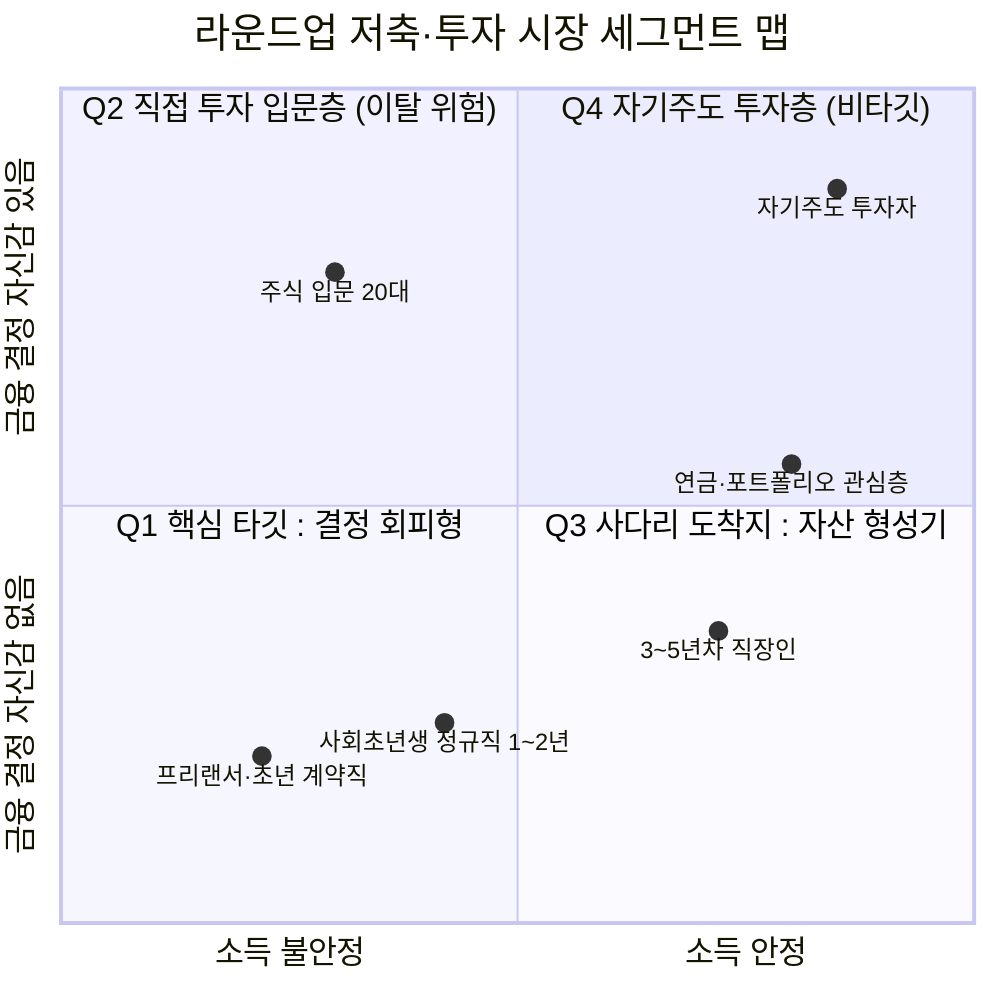
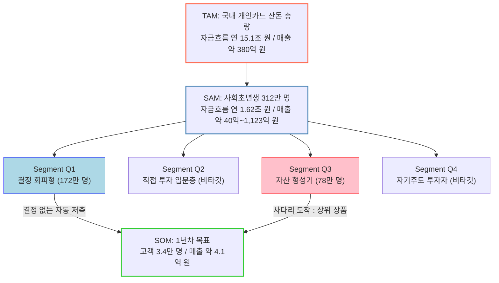

# TAM-SAM-SOM & Market Segment Map ① — 잔돈 라운드업 자동저축·소액 분산투자 서비스

> [분석 방법론](./분석-방법론.md) · 선행 분석 [Five Forces ①](../01-porters-five-forces/분석-01-라운드업-자동저축-소액투자.md) · [가치사슬 ①](../02-value-chain/분석-01-라운드업-자동저축-소액투자.md) · [KSF ①](../03-ksf/분석-01-라운드업-자동저축-소액투자.md)

## 0. 분석 단위와 전제

| 항목 | 설정 |
|---|---|
| 문제의식 | *"저축해야 하는 걸 아는데 남는 돈이 없다"* — 목돈도 저축 습관도 없는 사회초년생 |
| 솔루션 가설 | 카드 결제 시 1,000원 단위 반올림 잔돈을 자동 예치 → 임계금액 도달 시 분산 상품 자동 편입 |
| 수익 모델 | 예치 잔액 기반 관리보수 중심 + 일부 월정액 구독 |
| 지역·시점 | 국내, 2026년 기준 |

> 📎 **이 시장의 규모 산출이 까다로운 이유.** 이 서비스는 **"금액은 작고 건수는 많은"** 거래를 다루므로, 자금 흐름(잔돈 총액)은 조 단위로 커 보이지만 **실제 매출(잔액에 부과하는 보수)** 은 그것의 수백 분의 일이다. 따라서 아래에서는 **자금 흐름 규모와 매출 규모를 항상 나란히** 제시한다.

---

## 1. TAM — 전체 시장

### 1-1. Bottom-up: 국내에서 발생 가능한 '잔돈'의 총량

라운드업 서비스의 원재료는 **카드 결제 건수**다. 따라서 시장의 물리적 상한은 결제 건수로 계산된다.

| 단계 | 값 | 근거 등급 |
|---|---|---|
| 개인카드 승인 건수 (2025년 2분기) | **75.5억 건** | **[검증]** 여신금융협회 |
| 개인카드 승인 금액 (2025년 2분기) | **273조 7,000억 원** | **[검증]** 여신금융협회 |
| 연 환산 건수 | 75.5억 × 4 = **약 302억 건/년** | **[추정]** 분기 실적 단순 4배 |
| 1,000원 단위 반올림 시 건당 평균 잔돈 | **500원** | **[가정]** 결제 끝자리가 0~999원에 균등분포한다고 가정 |
| **연간 잔돈 발생 총액 (자금 흐름 TAM)** | 302억 건 × 500원 = **약 15.1조 원/년** | **[추정]** |

### 1-2. 자금 흐름을 매출로 환산

| 단계 | 값 | 근거 등급 |
|---|---|---|
| 연간 유입액 | 15.1조 원 | 위 산출 |
| 1년간 평균 예치 잔액 | 15.1조 × 50% = **약 7.6조 원** | **[가정]** 연중 균등 유입 → 평균 잔액은 유입액의 절반 |
| 관리보수율 | **연 0.5%** | **[가정]** 소액 자산관리 상품의 통상 범위 하단 |
| **매출 TAM** | 7.6조 × 0.5% = **약 380억 원/년** | **[추정]** |

> ⚠️ **이 표가 이 문서 전체의 결론을 미리 규정한다.** 자금 흐름으로는 **15.1조 원**이지만, 매출로 환산하면 **약 380억 원**이다. 그리고 이 380억 원은 **전 국민의 모든 카드 결제 잔돈을 단 하나의 사업자가 100% 가져간 경우**의 값이다. 즉 **이 시장의 매출 천장 자체가 낮다.**

### 1-3. 대조 검증 — 구독 모델을 상한으로 잡으면?

| 단계 | 값 | 근거 등급 |
|---|---|---|
| 국내 청년(19~34세) 인구 | **1,040만 4,000명** | **[검증]** 통계청 |
| 전원이 월 3,000원 구독 시 | 1,040만 × 3,000원 × 12 = **약 3,745억 원/년** | **[추정]** 비현실적 상한 |

> 📌 **구독 모델이 관리보수보다 10배 크다.** 이것이 Acorns가 월 $3~$12 구독료 모델을 택한 이유의 산술적 배경이다. 그러나 Five Forces ①은 이 집단의 **지불 의사가 구조적으로 낮다**고 판정했고, 월 3,000원은 잔액 30만 원 고객에게 **연 12% 이상의 비용률**이 된다. **즉 매출을 키우는 유일한 모델이 동시에 최대 이탈 요인이다.**

---

## 2. SAM — 서비스 가능한 시장

TAM에서 아래 조건을 순차로 걸어 좁힌다.

| 좁히는 조건 | 계산 | 결과 | 근거 등급 |
|---|---|---|---|
| ① 타깃 연령대 | 청년 19~34세 인구 | 1,040만 명 | **[검증]** |
| ② 경제활동 중(카드 결제가 상시 발생) | × 60% | 624만 명 | **[가정]** |
| ③ 목돈·저축 습관이 없는 층(문제의식 보유) | × 50% | **312만 명** | **[가정]** |

**1인당 잔돈 발생액 산출**

| 단계 | 값 | 근거 등급 |
|---|---|---|
| 연 개인카드 건수 ÷ 취업자 수 | 302억 건 ÷ 약 2,900만 명 = **약 1,040건/인·년** | **[추정]** |
| 1인당 연 잔돈 | 1,040건 × 500원 = **약 52만 원/년** | **[추정]** |

**SAM 산출**

| 구분 | 계산 | 값 |
|---|---|---|
| 자금 흐름 SAM | 312만 명 × 52만 원 | **약 1조 6,200억 원/년** |
| 평균 예치 잔액 | × 50% | 약 8,100억 원 |
| **매출 SAM (관리보수 0.5%)** | 8,100억 × 0.5% | **약 40억 원/년** |
| **매출 SAM (전원 구독 가정 상한)** | 312만 × 3,000원 × 12 | **약 1,123억 원/년** |

> ⚠️ **SAM 매출이 40억 원이라는 사실의 의미.** 이는 **국내 사회초년생 312만 명 전원이 이 서비스를 쓰는 경우**의 관리보수 매출이다. 가치사슬 ①에서 **"리스크관리·준법감시·정보보호·내부감사 조직은 규모와 무관하게 필요하며 초기 고정비의 큰 부분을 차지한다"**고 판정했는데, 그 고정비가 연 수십억 원 규모라면 **SAM 전체를 독점해도 관리보수만으로는 고정비를 넘기 어렵다.**

---

## 3. Market Segment Map

### 3-1. 축 선정

방법론 규칙 4에 따라 인구통계가 아닌 **행동 단서**로 축을 잡는다.

| 축 | 왜 이 축인가 |
|---|---|
| **X축 — 소득의 안정성** (불안정 ↔ 안정) | 잔돈 저축이 유지되는지를 결정한다. 출금 실패(잔액부족)의 빈도가 여기서 갈린다 |
| **Y축 — 금융 의사결정에 대한 자신감** (없음 ↔ 있음) | 이 서비스의 유일한 차별점이 **"결정을 요구하지 않는다"** 이므로, 자신감이 있는 층은 애초에 이 상품을 필요로 하지 않는다 |

### 3-2. 4분면

| 분면 | 세그먼트 | 행동 단서 | 판정 |
|---|---|---|---|
| **Q1** (좌하) | **결정 회피형 사회초년생** — 소득 불안정 + 자신감 없음 | 적금을 3개월 내 해지한 이력, 투자앱 설치했으나 미거래, 소액 결제는 하루 여러 번 | **1차 타깃 ✅** — 문제의식이 가장 강하고 "결정 없는 자동화"가 유일한 해답인 층 |
| **Q2** (좌상) | **직접 투자 입문층** — 소득 불안정 + 자신감 있음 | 소수점 주식·ETF를 직접 매수, 커뮤니티 정보 탐색 | **비타깃 ⚠️** — 증권 앱으로 직행하며, 우리 서비스를 "느린 우회로"로 인식 |
| **Q3** (우하) | **자산 형성기 직장인** — 소득 안정 + 자신감 없음 | 목돈이 생겼는데 어디 둘지 몰라 예금에 방치 | **사다리 도착지 ✅** — KSF ① 1순위인 상위 상품(목적자금·연금)의 실제 구매자 |
| **Q4** (우상) | **자기주도 투자자** — 소득 안정 + 자신감 있음 | 직접 리밸런싱, 세제 상품 활용 | **비타깃** |

> 📌 **Q1과 Q3을 함께 잡아야 하는 이유.** KSF ①은 **"매출이 발생할 지점이 없다"**는 문제를 지목하며 사다리 설계를 1순위로 놓았다. 세그먼트 맵으로 보면 그 사다리는 **Q1에서 진입해 Q3으로 이동하는 경로**다. 즉 이 사업의 성장은 신규 획득이 아니라 **고객이 Q1 → Q3으로 이동하도록 만드는 것**이다.

### 3-3. 세그먼트별 규모 배분

| 세그먼트 | SAM 인구 배분 **[가정]** | 자금 흐름 | 매출 성격 |
|---|---|---|---|
| Q1 결정 회피형 | 312만 × 55% = 172만 명 | 8,900억 원/년 | 관리보수(소액) + 구독 |
| Q3 자산 형성기 | 312만 × 25% = 78만 명 | 4,100억 원/년 | **상위 상품 판매 — 실질 수익원** |
| Q2 + Q4 | 312만 × 20% = 62만 명 | — | 비타깃 |

---

## 4. SOM — 1년차 목표 시장

### 4-1. 산출

| 단계 | 값 | 근거 등급 |
|---|---|---|
| 1차 타깃(Q1) 인구 | 172만 명 | 위 배분 |
| 1년차 침투율 | **2%** | **[가정]** 신규 금융 앱의 1년차 도달 범위 하단 |
| **1년차 고객 수** | **약 3만 4,000명** | **[추정]** |
| 자금 유입액 | 3.4만 × 52만 원 = **약 177억 원/년** | **[추정]** |
| 평균 예치 잔액 | × 50% = 약 88억 원 | **[추정]** |
| 관리보수 매출 (0.5%) | **약 4,400만 원/년** | **[추정]** |
| 구독 매출 (유료 전환 30% 가정) | 3.4만 × 30% × 3,000원 × 12 = **약 3억 7,000만 원/년** | **[가정]** |
| **1년차 총 매출 (SOM)** | **약 4억 1,000만 원/년** | **[추정]** |

### 4-2. 전체 구조

### 4-3. 민감도 — 가정을 바꾸면 결론이 바뀌는가

| 바꿀 가정 | 낙관 시나리오 | 1년차 매출 | 결론이 바뀌는가 |
|---|---|---|---|
| 침투율 2% → **5%** | 고객 8.5만 명 | 약 10억 원 | ❌ 바뀌지 않음 |
| 구독 전환 30% → **60%** | 유료 2만 명 | 약 7.8억 원 | ❌ |
| 관리보수 0.5% → **1.5%** | 잔액 보수 1.3억 원 | 약 5억 원 | ❌ |
| **세 가정 모두 낙관 적용** | — | **약 20억 원** | ❌ **여전히 규제 준수 고정비 수준** |
| **상위 상품 전환 추가** (Q1 → Q3 전환 10%, 1인당 연 20만 원 수익) | 3,400명 × 20만 원 = 6.8억 원 추가 | — | ⭕ **여기서만 구조가 바뀐다** |

> ⚠️ **민감도 분석의 결론.** 침투율·구독료·보수율을 아무리 낙관적으로 잡아도 **1년차 매출은 20억 원을 넘지 못한다.** 반면 **상위 상품 전환**을 넣으면 고객 1인당 매출이 한 자릿수 배로 뛴다. 즉 **이 시장에서 성장 레버는 고객 수가 아니라 고객 1인당 상품 수**다.

---

## 5. 종합 — 이 시장의 규모가 말해주는 것

| 항목 | 값 | 해석 |
|---|---|---|
| 자금 흐름 TAM | 연 15.1조 원 | 커 보이지만 매출이 아니다 |
| **매출 TAM** | **약 380억 원** | **전 국민 잔돈을 독점해도 이 정도** |
| 매출 SAM | 약 40억(보수) ~ 1,123억(구독) 원 | 모델 선택이 규모를 10배 이상 좌우 |
| **1년차 SOM** | **약 4.1억 원** | 사업 초기 고정비를 넘지 못한다 |

**핵심 결론 세 가지**

1. **이 시장의 문제는 침투율이 아니라 천장이다.** 매출 TAM 약 380억 원(관리보수 기준)은 **국내 전체 잔돈을 독점한 값**이다. 앞선 세 챕터가 판정한 *"단독 사업으로는 성립하기 어렵다"*가 여기서 숫자로 확인된다. Five Forces ①의 **"단가는 작고 고정비는 큰 조합"**이라는 서술이 곧 이 표다.

2. **매출을 키우는 유일한 모델이 최대 이탈 요인이다.** 구독 모델은 관리보수의 10배 이상 매출을 만들지만(3,745억 vs 380억), 월 3,000원은 잔액 30만 원 고객에게 연 12% 이상의 비용률이 된다. 이 역전을 상쇄한 사례가 **Acorns의 IRA 매칭(Silver 1%·Gold 3%)** 이며, 매칭 없이 구독료만 받는 설계는 Five Forces ①이 판정한 강한 구매자 교섭력에 그대로 노출된다.

3. **성장 레버는 고객 수가 아니라 세그먼트 이동이다.** 민감도 분석에서 침투율·요율을 모두 낙관해도 결론이 바뀌지 않았고, **Q1 → Q3 전환(사다리)** 을 넣었을 때만 구조가 바뀌었다. 따라서 이 사업의 KPI는 가입자 수가 아니라 **상위 상품 전환율**이어야 한다 — KSF ①이 지목한 1순위와 정확히 일치한다.

## 6. 다음 챕터로의 연결

| 다음 챕터 | 본 문서가 넘기는 입력 |
|---|---|
| 05 페르소나·고객여정 | **Q1(결정 회피형)** 과 **Q3(자산 형성기)** 두 페르소나. 특히 Q1 → Q3 **이동 여정**이 핵심 여정지도 대상 |
| 06 시장기회 분석(OS) | Q1은 문제 강도 높음·지불 의사 낮음, Q3은 문제 강도 중간·지불 의사 높음 → **기회점수가 역전되는 구조** |
| 07 JTBD | Q1의 Job = *"결정하지 않고도 돈이 모이게 하고 싶다"*, Q3의 Job = *"생긴 목돈을 어디 둘지 정하고 싶다"* |

---

## 출처

- 개인카드 승인 금액·건수, 건당 평균 승인금액 (2025년 2·3분기, 여신금융협회) — [파이낸셜뉴스: 2분기 카드 337조](https://www.fnnews.com/news/202607300931418122) · [서울신문: 3분기 카드 승인금액 6.7%↑](https://www.seoul.co.kr/news/newsView.php?id=20251031500040) · [여신금융협회 통계](https://www.crefia.or.kr/portal/infocenter/statistics/creditcardMonthResultUpdateView.xx) · [KOSIS 월간 국내카드승인실적](https://kosis.kr/statHtml/statHtml.do?orgId=435&tblId=DT_435001N_001)
- 청년(19~34세) 인구 1,040만 4,000명 — [네이트뉴스: 매년 감소하는 청년인구](https://news.nate.com/view/20251216n17134) · [KOSIS 인구로 보는 대한민국](https://kosis.kr/visual/populationKorea/PopulationDashBoardDetail.do?statJipyoId=3739&vStatJipyoId=5901&listId=A_02)
- 청년 고용률·취업자 수 — [지표누리: 청년 고용동향](https://www.index.go.kr/unity/potal/main/EachDtlPageDetail.do?idx_cd=1495)
- Acorns 구독 티어·IRA 매칭 — [Forbes Advisor: Acorns Review](https://www.forbes.com/advisor/investing/acorns-review/) · [Acorns 공식](https://www.acorns.com/learn/acorns/how-does-acorns-work/)

> ⚠️ **검증 필요 항목.** 위 산출에서 **[가정]** 으로 표기한 값(경제활동 참여율 60%, 문제의식 보유율 50%, 관리보수율 0.5%, 침투율 2%, 구독 전환율 30%, 잔돈 균등분포)은 근거 자료가 없는 설정값이다. 실제 사업 판단에 사용하려면 (a) 카드 결제 끝자리 분포 실측 (b) 타깃 집단 설문을 통한 지불 의사 확인 (c) 유사 서비스의 공개 지표 확보가 필요하다. 단, **5장의 결론은 이 가정들을 모두 낙관적으로 바꿔도 유지된다**(4-3 민감도 참조).
