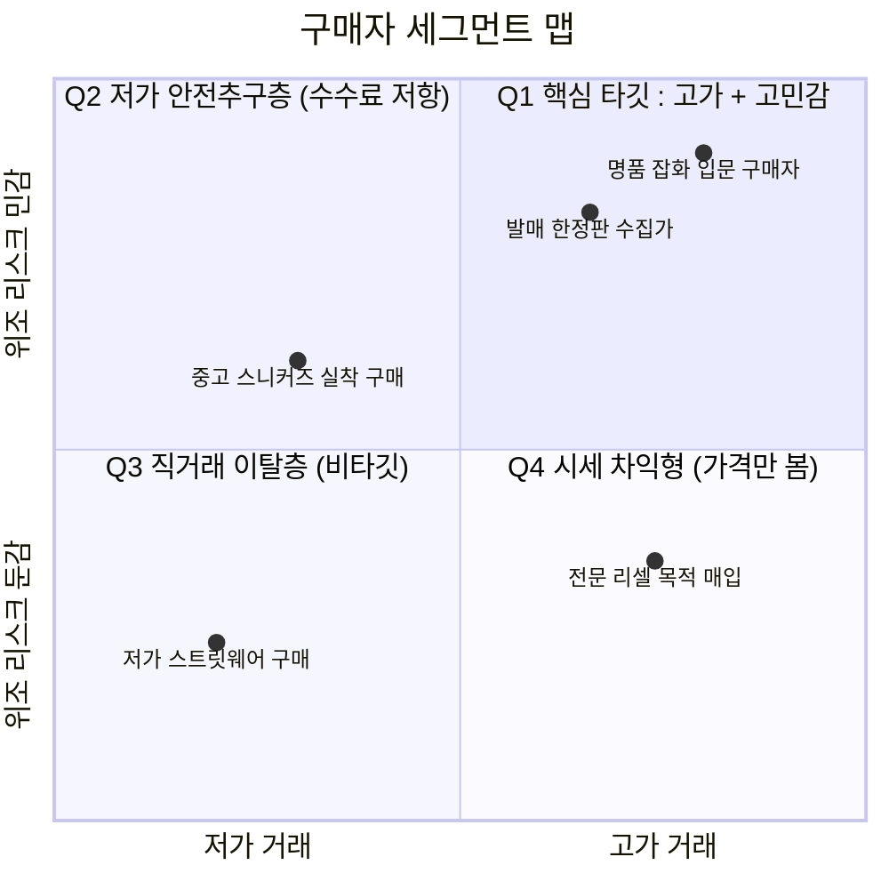
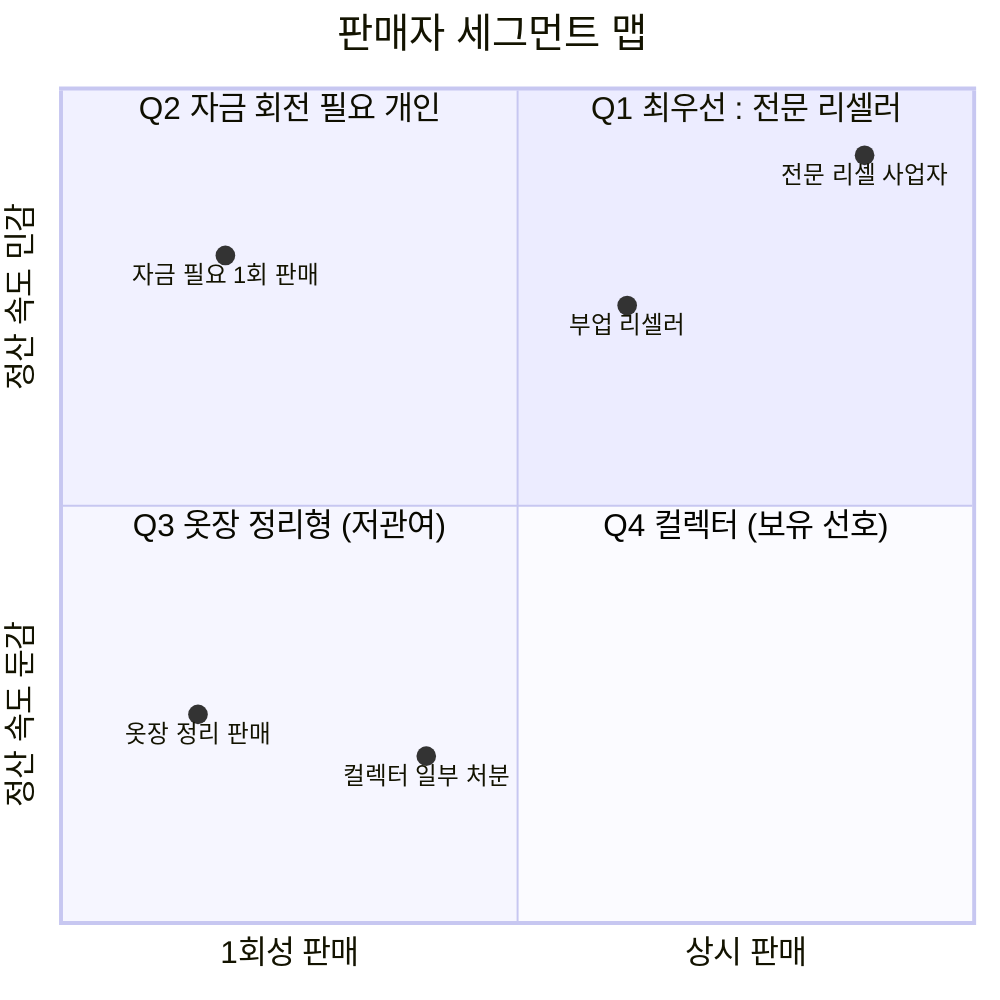
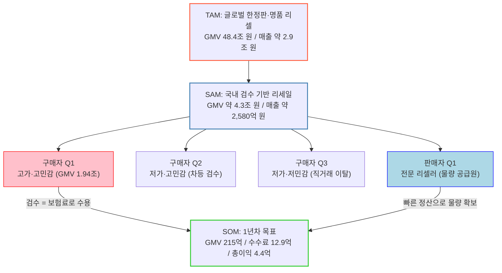

# TAM-SAM-SOM & Market Segment Map ② — 정품검수 기반 한정판 스니커즈·명품 리세일 C2C 플랫폼

> [분석 방법론](./분석-방법론.md) · 선행 분석 [Five Forces ②](../01-porters-five-forces/분석-02-한정판-리세일-정품검수-플랫폼.md) · [가치사슬 ②](../02-value-chain/분석-02-한정판-리세일-정품검수-플랫폼.md) · [KSF ②](../03-ksf/분석-02-한정판-리세일-정품검수-플랫폼.md)

## 0. 분석 단위와 전제

| 항목 | 설정 |
|---|---|
| 문제의식 | 개인 간 한정판 거래에서 **가짜 판별 불가·선입금 후 미배송·상태 분쟁**이 반복된다. 병목은 물류가 아니라 **신뢰**다 |
| 솔루션 가설 | 플랫폼이 상품을 물리적으로 받아 정품 검수 후 전달하고, 대금은 검수 통과 시점까지 보관한다 |
| 수익 모델 | 거래 수수료 중심 + 검수·보관 서비스·시세 데이터 |
| 지역·시점 | 국내, 2026년 기준 |

> 📎 **이 시장의 규모 산출이 까다로운 이유.** 거래액(GMV)은 조 단위로 커지지만 **수수료율이 한 자릿수 퍼센트**이고, 그 수수료에서 **검수 인건비와 물류비가 거래 건수에 비례해 빠져나간다.** 따라서 아래에서는 GMV → 수수료 매출 → **검수·물류 원가 차감 후 총이익**까지 3단으로 내려간다.

---

## 1. TAM — 전체 시장

### 1-1. Top-down: 글로벌 한정판·명품 리셀 시장

| 단계 | 값 | 근거 등급 |
|---|---|---|
| 글로벌 재판매(리세일) 시장 전체 | **155조 8,000억 원** (전년 대비 +24%) | **[검증]** ThredUp 보고서, 2022년 기준 |
| 그중 **한정판·명품 리셀** 비중 | 약 31% | **[검증]** |
| **TAM (글로벌 한정판·명품 리셀 거래액)** | **48조 4,000억 원** | **[검증]** |

**성장 궤적 참고**

| 지표 | 값 | 근거 등급 |
|---|---|---|
| 글로벌 스니커즈 리셀 시장 | 2020년 60억 달러 → **2030년 300억 달러** (연평균 +16%) | **[검증]** Cowen & Co. 전망 |

### 1-2. GMV를 매출로 환산

| 단계 | 값 | 근거 등급 |
|---|---|---|
| TAM GMV | 48.4조 원 | 위 산출 |
| 플랫폼 수수료율 | **6%** | **[검증→적용]** 크림 2026년 3월 개편 기준 등급별 판매 수수료 5.5~6% 중 상단 |
| **매출 TAM** | 48.4조 × 6% = **약 2조 9,000억 원** | **[추정]** |

> 📌 **시장 ①과의 첫 번째 대비.** 시장 ①의 매출 TAM은 약 380억 원이었다. 이 시장은 **약 2조 9,000억 원** — 약 76배다. 자금 흐름 기준으로는 15.1조 대 48.4조로 3배 차이인데, 매출 기준으로 격차가 벌어지는 이유는 **수수료율이 0.5%가 아니라 6%** 이기 때문이다. **요율을 6%로 받을 수 있다는 사실 자체가 이 시장의 최대 강점이며, 그 근거는 검수라는 지불 이유다.**

---

## 2. SAM — 서비스 가능한 시장 (국내)

### 2-1. 산출

| 구성 요소 | 값 | 근거 등급 |
|---|---|---|
| 국내 리셀(한정판) 시장 | 2021년 7,000억 → 2022년 1조 돌파 → **약 2조 8,000억 원** | **[검증]** 2025~26년 기준 |
| 국내 명품 시장 전체 | **18조 6,146억 원** (141억 6,500만 달러, 세계 7위) | **[검증]** 2021년 기준 |
| 국내 중고 명품 시장 | 2021년 **1조 3,000억 원** (명품 시장의 10% 미만) → 2025년 **전년 대비 +52% 성장** | **[검증]** 절대값은 미공표 |
| 국내 중고 명품 시장 현재 규모 | **약 2조 5,000억 원** | **[추정]** 2021년 1.3조에서 성장률 반영 |
| 그중 온라인·검수 채널 비중 | × 60% = 1조 5,000억 원 | **[가정]** 오프라인 중고 명품 매장·개인 직거래 제외 |
| **SAM (국내 검수 기반 한정판·명품 리세일 GMV)** | 2.8조 + 1.5조 = **약 4조 3,000억 원** | **[추정]** |
| **매출 SAM (수수료 6%)** | **약 2,580억 원/년** | **[추정]** |

### 2-2. Top-down vs Bottom-up 교차 검증 — 어긋난 지점

방법론 규칙 2에 따라 실제 사업자 실적과 대조한다.

| 대조 지표 | 값 | 근거 등급 |
|---|---|---|
| 크림 2025년 합산 매출 | **3,975억 원** (역대 최대) | **[검증]** |
| 위에서 산출한 **매출 SAM 전체** | 약 2,580억 원 | **[추정]** |

> ⚠️ **1위 사업자 한 곳의 매출이 우리가 계산한 SAM 전체보다 크다.** 이는 산출 오류가 아니라 **SAM 정의 범위가 좁다는 신호**다. 원인은 두 가지다.
>
> 1. **크림의 매출은 거래 수수료만이 아니다.** 합산 기준 매출에는 상품 직접 판매·기타 매출이 포함된다.
> 2. **크림의 취급 범위가 우리 SAM보다 넓다.** 크림은 신발에서 **의류·테크·금은**까지 카테고리를 확장했고, 이 확장이 2025년 역대 최대 실적의 배경으로 지목된다. 반면 본 분석의 SAM은 **한정판 스니커즈·명품**으로 한정했다.
>
> **신규 진입자 관점에서는 좁은 SAM이 오히려 옳다.** KSF ② 4순위는 *"위조율이 높고 검수 가치가 가장 큰 카테고리부터 시작하라"* 고 판정했으므로, 확장 후 범위가 아닌 **진입 시점의 좁은 범위**로 SAM을 잡는 것이 의사결정에 맞다. 다만 이 문서를 읽는 사람은 **"성공 시 확장 가능한 범위는 SAM보다 넓다"** 는 점을 함께 알아야 한다.

---

## 3. Market Segment Map

이 시장은 **양면 시장**이므로 지도를 두 개 그린다. 가치사슬 ②에서 *"양면 시장이므로 마케팅이 두 개다"* 라고 판정한 것을 세그먼트 단위로 옮긴 것이다.

### 3-1. 구매자 세그먼트 맵

| 축 | 왜 이 축인가 |
|---|---|
| **X축 — 거래 1건의 금액대** (저가 ↔ 고가) | 검수 수수료를 지불할 의사가 금액에 비례한다. 3만 원 거래에 6% 수수료는 거부되고, 300만 원 거래에서는 보험료로 인식된다 |
| **Y축 — 위조 리스크 민감도** (낮음 ↔ 높음) | 이 플랫폼이 파는 것이 상품이 아니라 **안전**이므로, 이 민감도가 곧 지불 의사다 |

| 분면 | 세그먼트 | 행동 단서 | 판정 |
|---|---|---|---|
| **Q1** (우상) | **고가·고민감 구매자** — 명품 잡화, 발매 한정판 | 정품 인증서·검수 사진을 먼저 확인, 커뮤니티에서 가품 사례를 검색해본 이력 | **1차 타깃 ✅** — 수수료를 **보험료로 인식**하는 유일한 층 |
| **Q2** (좌상) | **저가·고민감 구매자** | 가짜는 무섭지만 수수료는 아깝다 | **2차 ⚠️** — 차등 검수(간이 확인)로만 흡수 가능 |
| **Q3** (좌하) | **저가·저민감 구매자** | 중고거래 앱·오픈채팅 직거래 선호 | **비타깃 ❌** — Five Forces ②가 *"저가 상품군에서 직거래 대체 위협이 가장 크다"* 고 판정한 층 |
| **Q4** (우하) | **시세 차익형 매입자** | 최저가만 보고 플랫폼을 옮겨다님(멀티호밍) | **비타깃** — 판매자 세그먼트로 전환시킬 대상 |

### 3-2. 판매자 세그먼트 맵

| 축 | 왜 이 축인가 |
|---|---|
| **X축 — 거래 빈도** (1회성 ↔ 상시) | KSF ②는 *"전문 리셀러의 LTV가 압도적"* 이라고 판정했다. 빈도가 곧 LTV다 |
| **Y축 — 정산 속도 민감도** (낮음 ↔ 높음) | 발란 사례가 보여준 대로, 정산이 판매자 이탈의 방아쇠다. 민감도가 높은 층에는 **정산이 곧 제품**이다 |

| 분면 | 세그먼트 | 판정 |
|---|---|---|
| **Q1** (우상) | **전문 리셀러** — 상시 판매 + 정산 민감 | **최우선 ✅** — 발란 사례에서 **상위 판매자 10여 명이 거래액의 약 27%** 를 차지했다. 물량이 이들에게서 나온다 |
| **Q2** (좌상) | 자금 회전이 필요한 1회 판매자 | 2차 — 빠른 정산으로 유치 후 재판매 유도 |
| **Q3** (좌하) | 옷장 정리형 | 저관여, 획득 비용을 쓰지 않음 |
| **Q4** (우하) | 컬렉터 | **보관 서비스의 타깃** — KSF ② 5순위(증명 상품화)와 연결 |

> 📌 **두 맵을 겹쳐 보면 성장 경로가 보인다.** 구매자 Q4(시세 차익형)와 판매자 Q1(전문 리셀러)은 **같은 사람일 수 있다.** 가치사슬 ②가 *"구매자→판매자 전환이 이 사업 최고의 성장 레버"* 라고 판정한 근거가 이 겹침이다.

### 3-3. 세그먼트별 GMV 배분

| 세그먼트 | SAM GMV 배분 **[가정]** | 수수료 수용도 |
|---|---|---|
| Q1 고가·고민감 | 4.3조 × 45% = **1조 9,350억 원** | 높음 — 6% 수용 |
| Q2 저가·고민감 | 4.3조 × 25% = 1조 750억 원 | 중간 — 차등 검수 필요 |
| Q3 저가·저민감 | 4.3조 × 20% = 8,600억 원 | 낮음 — 직거래로 이탈 |
| Q4 시세 차익형 | 4.3조 × 10% = 4,300억 원 | 낮음 — 판매자로 전환 대상 |

---

## 4. SOM — 1년차 목표 시장

### 4-1. 산출 (GMV → 수수료 → 총이익)

| 단계 | 값 | 근거 등급 |
|---|---|---|
| 1차 타깃(Q1) GMV | 1조 9,350억 원 | 위 배분 |
| 1년차 점유율 | **1.1%** | **[가정]** 신규 진입자의 1년차 도달 범위 |
| **1년차 GMV (SOM)** | **약 215억 원** | **[추정]** |
| 수수료율 | 6% | **[검증→적용]** |
| **수수료 매출** | **약 12억 9,000만 원** | **[추정]** |

**여기서 검수·물류 원가를 차감한다** — 이 시장의 핵심 특성

| 원가 항목 | 계산 | 값 | 근거 등급 |
|---|---|---|---|
| 거래 건수 | 215억 ÷ 건당 평균 30만 원 | 약 7만 2,000건/년 (월 약 6,000건) | **[가정]** 건당 평균 거래액 |
| 검수 인력 | 월 6,000건 ÷ (1인 하루 40건 × 20일) ≈ 8명 | 인건비 월 350만 × 8 × 12 = **약 3억 4,000만 원** | **[가정]** |
| 물류비 | 7.2만 건 × 5,000원 | **약 3억 6,000만 원** | **[가정]** |
| 검수센터 임차·설비 | — | **약 1억 5,000만 원** | **[가정]** |
| **원가 합계** | — | **약 8억 5,000만 원** | **[추정]** |
| **총이익** | 12.9억 − 8.5억 | **약 4억 4,000만 원** (GMV의 **2.0%**) | **[추정]** |

> ⚠️ **거래액 215억 원에서 남는 것이 4.4억 원이다.** 그것도 마케팅·개발·CS 비용을 차감하기 **전**이다. Five Forces ②가 판정한 **"거래액과 이익이 비례하지 않는 구조"** 가 여기서 숫자로 확인된다. GMV를 두 배로 늘려도 검수 인력과 물류비가 함께 늘어나므로 총이익률 2%대는 크게 개선되지 않는다.

### 4-2. 전체 구조

### 4-3. 민감도 — 무엇을 바꿔야 구조가 바뀌는가

| 바꿀 가정 | 시나리오 | 총이익 | 구조가 바뀌는가 |
|---|---|---|---|
| GMV 215억 → **430억** (점유율 2배) | 원가도 약 2배(검수 16명·물류 7.2억) | 약 8.4억 원 | ❌ **이익률 2%대 그대로** |
| 건당 평균 30만 → **60만 원**(고가 집중) | 건수 절반 → 검수 4명·물류 1.8억 | **약 9억 4,000만 원** | ⭕ **이익률 4.4%로 개선** |
| 수수료 6% → **9%**(증명 상품화 후) | 매출 19.4억 | **약 10억 9,000만 원** | ⭕ **이익률 5.1%** |
| 수수료 밖 수익원 추가(보관·데이터, GMV의 1%) | +2.2억 | 약 6.6억 원 | ⭕ |
| **고가 집중 + 요율 인상 동시 적용** | — | **약 16억 원** (이익률 **7.4%**) | ⭕⭕ |

> 📌 **민감도 분석의 결론.** 이 시장에서 **점유율을 늘리는 것은 이익률을 개선하지 못한다**(원가가 함께 늘기 때문). 개선되는 것은 **① 건당 금액을 올리는 것(고가 집중) ② 요율을 올리는 것(증명 상품화) ③ 수수료 밖 수익원**뿐이다. 이는 KSF ②의 우선순위(1위 무사고 신뢰 → 4위 가격 정책 → 5위 수수료 밖 수익원)와 정확히 일치한다.

---

## 5. 종합 — 이 시장의 규모가 말해주는 것

| 항목 | 값 | 해석 |
|---|---|---|
| TAM GMV / 매출 | 48.4조 원 / 약 2.9조 원 | 요율 6% 덕분에 매출 TAM이 크다 |
| SAM GMV / 매출 | 약 4.3조 원 / 약 2,580억 원 | 크림 단독 매출(3,975억)이 이보다 큼 → SAM 정의가 좁다는 신호 |
| **1년차 SOM** | GMV 215억 / 수수료 12.9억 / **총이익 4.4억** | **GMV의 2.0%만 남는다** |

**핵심 결론 세 가지**

1. **이 시장의 강점은 규모가 아니라 요율이다.** 시장 ①과 비교하면 자금 흐름 격차는 3배(15.1조 vs 48.4조)인데 매출 격차는 76배(380억 vs 2.9조)로 벌어진다. 차이를 만든 것은 오직 **요율(0.5% vs 6%)** 이며, 그 요율의 근거는 **검수라는 지불 이유**다. KSF ②가 *"고객이 돈을 낼 이유가 이미 명확하다"* 고 판정한 것의 금전적 가치가 이 격차다.

2. **그러나 그 요율이 원가에 먹힌다.** 수수료 매출 12.9억 원에서 검수·물류 원가 8.5억 원이 빠져 총이익은 4.4억 원(GMV의 2.0%)에 그친다. 가치사슬 ②의 *"규모의 경제를 이 활동에서는 누리지 못한다"* 는 판정이 그대로 확인된다. **점유율을 두 배로 늘려도 이익률은 개선되지 않았다.**

3. **개선 경로는 세 가지뿐이고, 모두 세그먼트 선택의 문제다.** 민감도 분석에서 구조가 바뀐 것은 ① 고가 세그먼트 집중 ② 요율 인상 ③ 수수료 밖 수익원이었다. 셋 중 ①은 **Segment Map의 Q1에 집중하라는 지시**이고, ②·③은 **그 집중이 만들어낸 신뢰를 상품화하라는 지시**다. 즉 **이 시장에서 세그먼트 선택은 마케팅 결정이 아니라 손익 결정이다.**

## 6. 다음 챕터로의 연결

| 다음 챕터 | 본 문서가 넘기는 입력 |
|---|---|
| 05 페르소나·고객여정 | 페르소나 **3개** — 구매자 Q1(고가·고민감), 판매자 Q1(전문 리셀러), 그리고 둘을 잇는 **구매자→판매자 전환 여정** |
| 06 시장기회 분석(OS) | 구매자 Q1은 문제 강도·지불 의사 모두 높음 / Q3(저가·저민감)은 **기회점수가 음수에 가까움**(직거래 대체) |
| 07 JTBD | 구매자 Q1의 Job = *"가짜일 가능성을 0으로 만들고 싶다"*, 판매자 Q1의 Job = *"판 돈을 예정된 날에 정확히 받고 싶다"* |

---

## 출처

- 글로벌 재판매 시장 155.8조 원 / 한정판·명품 리셀 48.4조 원(31%), 글로벌 스니커즈 리셀 2020년 60억 → 2030년 300억 달러 — [KISDI: 리셀 플랫폼 시장 현황과 시사점](https://kisdi.re.kr/report/view.do?key=m2102058837181&masterId=4334696&arrMasterId=4334696&artId=1167956) · [한국벤처투자: MZ세대의 재테크 '리셀'](https://kvicnewsletter.co.kr/page/view.php?idx=316) · [CRETEC: 새로운 투자시장 리셀](https://www.cretec.kr/webzine/sub/wz_view.jsp?bid=7&num=2861)
- 국내 리셀 시장 규모(2021년 7,000억 → 2022년 1조 → 약 2.8조 원) — [MarqVision: 국내 리셀 시장 규모 2.8조](https://www.marqvision.com/kr/blog-kr/resell-market-gray-market-brand-trust-2026)
- 국내 명품 시장 18조 6,146억 원(세계 7위), 중고 명품 1조 3,000억 원 — [아시아경제: 비대면 소비로 큰 명품 플랫폼](https://www.asiae.co.kr/article/2023033116472829859) · [오픈애즈: 중고명품 시장, MZ가 눈돌리는 이유](https://openads.co.kr/content/contentDetail?contsId=9532)
- 국내 중고 명품 2025년 전년 대비 +52% 성장, 신규 등록 3,900만 건 — [벤처스퀘어: 번개장터 K-럭셔리 세컨핸드 시장 보고서](https://www.venturesquare.net/1056001) · [디지털데일리: 번개장터 럭셔리 리세일 보고서](https://m.ddaily.co.kr/page/view/2024081209235337222)
- 크림 2025년 합산 매출 3,975억 원, 카테고리 확장, 가입자 160만·2030 비중 80% — [그린포스트코리아: 크림 의류·테크 확장으로 매출](https://www.greened.kr/news/articleView.html?idxno=339143) · [네이버: 크림 시리즈B 투자 유치](https://www.navercorp.com/media/pressReleasesDetail?seq=30584) · [테크M](https://www.techm.kr/news/articleView.html?idxno=8184)
- 크림 수수료율(등급별 5.5~6%) — [머니투데이: 크림 판매 수수료 3월부터 오른다](https://www.mt.co.kr/tech/2026/02/04/2026020410024549619)
- 발란 상위 판매자 10여 명 = 거래액 약 27% — [MBC: 발란, 미정산 판매자와 면담](https://imnews.imbc.com/news/2025/econo/article/6706676_36737.html)

> ⚠️ **검증 필요 항목.** **[가정]** 으로 표기한 값(중고 명품의 온라인·검수 채널 비중 60%, 세그먼트별 GMV 배분, 1년차 점유율 1.1%, 건당 평균 거래액 30만 원, 검수 1인 하루 40건, 물류비 건당 5,000원)은 설정값이다. 특히 **건당 평균 거래액과 검수 처리량**은 총이익을 직접 결정하므로, 실제 판단에는 카테고리별 실측이 필요하다. 다만 **5장 결론(점유율 확대로는 이익률이 개선되지 않는다)은 이 가정들의 절대값이 아니라 "원가가 건수에 비례한다"는 구조에서 나오므로 유지된다.**
