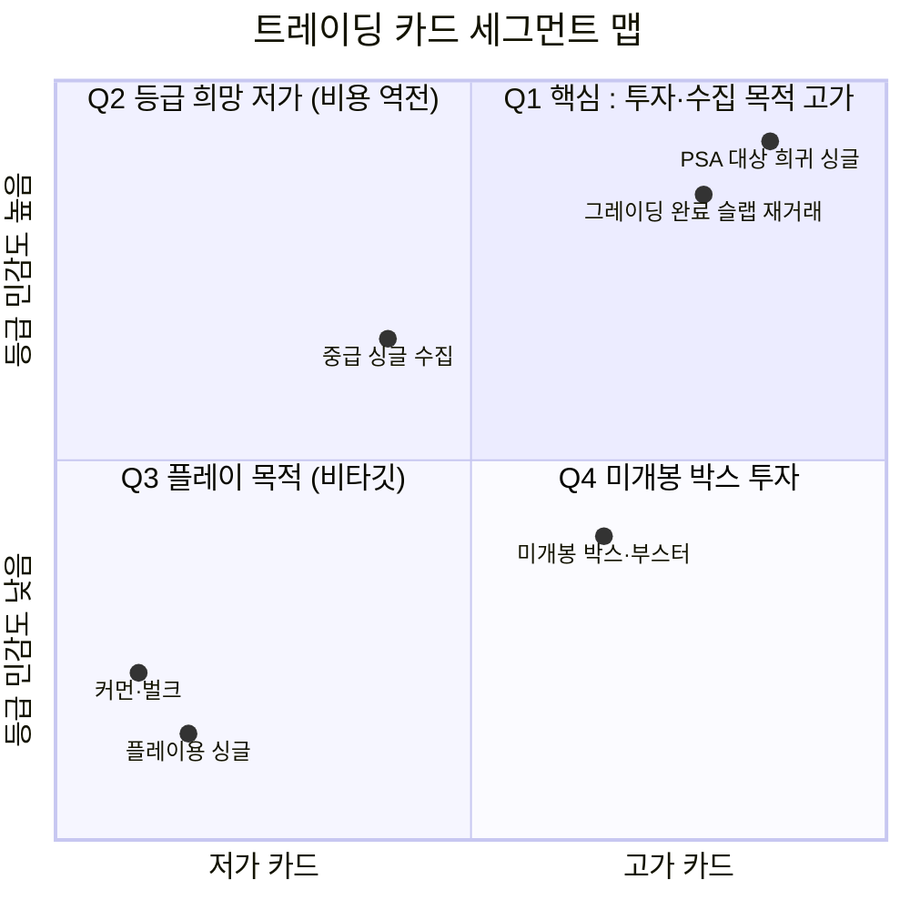

# TAM-SAM-SOM 심층 검증 — 트레이딩 카드 정품검수·그레이딩 플랫폼 아이템

> [분석 방법론](./분석-방법론.md) · 상위 분석 [시장 ② TAM-SAM-SOM](./분석-02-한정판-리세일-정품검수-플랫폼.md) · [KSF ②](../03-ksf/분석-02-한정판-리세일-정품검수-플랫폼.md)

## 0. 이 문서의 성격과 한계

### 0-1. 왜 이 문서가 별도로 존재하는가

`분석-02`는 **"정품검수 기반 한정판 리세일 플랫폼"이라는 시장 영역**의 규모를 산출했다. 본 문서는 그 시장에서 **실제로 어떤 아이템으로 진입할 것인가**를 정한 뒤, 그 아이템 단위로 TAM-SAM-SOM을 재산출한 것이다.

선정 논리는 다음과 같았다.

| 후보 아이템 | 판정 | 사유 |
|---|---|---|
| 한정판 스니커즈 | 탈락 | 크림 선점(가입자 160만, 2025 매출 3,975억) |
| 명품 시계 | 탈락 | 바이버(두나무 계열) 선점, 오감정 0건 실적 |
| 명품 가방 | 탈락 | 1점물이라 SKU 표준화 불가 → 시세 엔진 구축 불가 |
| 한정판 위스키·와인 | 탈락 | 국내 주류 통신판매 규제 |
| **트레이딩 카드** | **선정** | **검수(등급)가 상품 가격을 직접 만드는 유일한 카테고리** |

핵심 가설은 **"PSA 10을 받으면 가격 자체가 뛰므로, 거래 수수료와 별도로 검수 수수료를 받을 수 있고 GMV 대비 총이익률이 2%(스니커즈) → 13%대로 뛴다"** 였다.

### 0-2. ⚠️ 리서치 완료 상태 — 반드시 감안할 것

이 아이템을 검증하기 위해 7개 항목의 딥리서치를 계획했으나 **2개만 완료**되었다.

| # | 리서치 항목 | 상태 | 본 문서 반영 |
|---|---|---|---|
| 1 | 시장 규모 검증 | ✅ 완료 | §1~§5 전부 |
| 2 | 그레이딩 산업 구조(요금·리드타임·권위) | ⬜ 미완 | §6에 부분 반영(3번 조사에서 파생 확인된 범위) |
| 3 | 사전 선별 웨지 성립 여부 | ✅ 완료 | §6 전부 |
| 4 | 경쟁 지형(크림·eBay AG 등) | ⬜ 미완 | §2·§6에 부분 반영(1번 조사에서 파생 확인된 범위) |
| 5 | 규제·법률 | ⬜ **미완** | 미반영 |
| 6 | 발매사(포켓몬코리아) 물량·리세일 정책 | ⬜ **미완** | 미반영 |
| 7 | 원가 구조 실증(그레이딩 처리량·설비·물류) | ⬜ **미완** | 미반영 — **§4의 원가는 전부 [가정]** |

리서치 중단 사유: WebSearch 예산 소진(200/200) 및 백그라운드 작업 중단.

> **따라서 §4의 손익 추정은 원가 실측 없이 작성된 것이며, §7의 판정은 완료된 2개 항목만으로 내려진 것이다.** 다만 그 2개가 이 아이템의 생사를 가르는 두 축(시장 규모 + 웨지 성립)이었으므로, 나머지 5개를 채워도 판정이 뒤집힐 가능성은 낮다.

### 0-3. 🔴 선행 분석의 사실 오류 정정

이 아이템을 추천할 때 다음과 같이 서술했으나 **사실과 다르다.**

> ~~"국내에는 PSA 대행 업체가 있을 뿐, 국내에서 등급을 매겨 시장이 인정하는 기관은 확인되지 않는다"~~

**정정: 국내 그레이딩 기관이 최소 3개 존재하며 이미 시장에서 사용되고 있다.**

| 기관 | 확인된 내용 | 근거 |
|---|---|---|
| **BRG** (브레이크앤컴퍼니) | 2021년 시작, 서울. 레귤러 약 15영업일 / 익스프레스 약 5영업일. 국내 택배로 완결(해외 발송·대행 불필요). 포켓몬·스포츠카드 + **K-pop 포토카드** 취급 | **[검증]** break.co.kr, cardpick.kr |
| **CCG** | "Artwork AI Grading". REGULAR **$9.9/장**, EXPRESS $25(14영업일), CRACK & GRADE $8.9. "타사 대비 50% 이상 저렴" | **[검증]** ccgcard.kr |
| **GOD** | 신규 진입 | **[검증]** 커뮤니티 통칭 "국내 그레이딩 3대장" |

이 정정이 아이템 전체 판정을 바꾼다. 상세는 §6-1.

---

## 1. TAM — 전체 시장

### 1-1. 국내 공식 통계는 존재하지 않는다 (그 자체가 최상위 발견)

| 확인 대상 | 결과 |
|---|---|
| 한국콘텐츠진흥원 캐릭터산업백서·콘텐츠산업전망 | 트레이딩 카드 **독립 항목 없음** |
| 한국완구공업협동조합 통계 | 카드게임 **별도 집계 없음** (일본완구협회는 매년 집계) |
| 게임산업백서 | 항목 없음 |
| 크림·번개장터·당근·중고나라 | 카테고리별 거래액 **전부 비공개** |
| 포켓몬코리아 | 카드 부문 분리 매출 **비공개** |
| PSA·BGS·CGC | 한국발 그레이딩 물량 **비공개** |
| 국내 아트토이·피규어·건프라·레고 리셀 시장 규모 | **통계 자체가 없음** |

국내 언론 보도는 **예외 없이 증가율(%)만 인용하며 절대 금액을 제시하지 않는다.**

> ⚠️ **키덜트 시장 수치는 사용 불가.** 자주 인용되는 계보를 추적한 결과 — 5,000억원(2014, KOCCA) → 1조원(2016, 성장률 가정 기반 추산) → 1조 6,000억원(2020 또는 2021, **출처 간 연도 불일치**) → **11조원(출처 불명. 2022년 머니투데이 기사 제목이 반복 재인용되며 사실처럼 굳어진 사례)**. 게다가 국내 완구 시장은 실측으로 **2019년 2조 320억 → 2021년 2조 120억으로 감소**했다. "완구가 줄었는데 키덜트가 11조"는 양립하지 않는다.

### 1-2. 공급측 실적 — 유일하게 검증 가능한 앵커

절대 시장 규모 통계가 없으므로, **기업 감사보고서·공시가 유일한 검증 앵커**다.

**포켓몬코리아 (감사보고서 기반) [검증]**

| 연도 | 매출액 | 영업이익 |
|---|---|---|
| 2022 | **899억 2,459만원** | 370억 9,985만원 |
| 2023 | 675억 9,043만원 | 218억 6,868만원 |
| 2024 | **465억 3,775만원** | 88억 6,104만원 |
| 2025 | 732억 7,210만원 | 132억 7,532만원 |

> 🔴 **2022년 899억 → 2024년 465억 = -48%.** 이 시장은 **이미 한 번 반토막 났다.** 2025년 733억도 2022년 피크를 회복하지 못한 수준(-18.5%)이다. 2026년의 급등은 사상 첫 사이클이 아니라 **두 번째 사이클**이다.
> 단, 포켓몬코리아 매출은 카드 단독이 아니라 게임·애니메이션·캐릭터 라이선스 전반을 포함한다 **[검증]**.

**대원미디어 카드사업 부문 [검증]** — 국내 TCG 유통 점유율 1위

| 항목 | 값 |
|---|---|
| 2026년 1분기 카드 부문 매출 | **50억 5,000만원** (2025년 1Q 47억 6,000만원) |
| 연 환산 | **약 202억원 [추정]** (1Q × 4) |
| 유희왕 판매량 | 월 **50만~100만팩**, 누적 매출 1,250억원 |
| 취급 IP | 유희왕, 뱅가드, 디지몬, 니벨아레나(자체) + Topps EPL·MLB·NBA |

**[추정] 팩 판매량 역산 교차검증**: 월 50만~100만팩 × 12 = 연 600만~1,200만팩 × 팩당 소비자가 **[가정] 2,500원** = **연 소매 150억~300억원**. 출하 기준 202억원과 유통마진 감안 시 정합적 → **이 수치는 신뢰할 만하다.**

### 1-3. 국내 1차 시장(신품 소매) 합산 — [추정]

| 항목 | 소매 기준 | 근거 등급 |
|---|---|---|
| 포켓몬 카드 | 512억~718억원 | [추정] 733억 × 카드비중 **[가정] 50~70%** × 유통마진 **[가정] 1.4배** |
| 유희왕·디지몬·뱅가드 | 150억~300억원 | [추정] 팩 판매량 역산 |
| 일본판 병행수입·구매대행 | 200억~500억원 | 🔴 **[가정]** — 검증 데이터 전무. 최대 오차원 |
| 원피스 TCG·MTG·스포츠카드·기타 | 100억~300억원 | 🔴 **[가정]** |
| **합계** | **약 1,000억~1,800억원** | [추정] |

### 1-4. 해외 TAM (참고)

| 지표 | 값 | 근거 등급 |
|---|---|---|
| 일본 카드게임·트레이딩카드 시장(일본완구협회) | 2020년 1,222억엔 → 2022년 2,349억엔 → 2024년 3,024억엔 → **2025년도 3,384억엔** (완구시장의 **29.0%**) | **[검증]** |
| 일본 시장 원화 환산 | 약 **3조 2,150억원** | [추정] 환율 **[가정]** 9.5원/엔 |
| 미국 트레이딩 카드 시장 | **2025년 105억 4,000만 달러** → 2033년 178억 2,000만 달러 | **[검증]** Grand View Research |
| 미국 2차 시장 유통 | 판매 카드 32억 장 중 **16억 장이 2차 시장** 거래. 스포츠+포켓몬이 2차 거래의 **74% 이상** | **[검증]** |
| eBay 스포츠카드 싱글 판매액 | **2026년 상반기 13억 6,000만 달러** (2025년 상반기 8억 1,563만 → **+67%**) | **[검증]** |
| 글로벌 그레이딩 물량 | 2024년 약 2,000만 장 → **2025년 2,660만 장**(GemRate 사상 최대). PSA **1,926만 장**(+26%), TCG **1,100만 장+**, PSA의 TCG 중 **포켓몬 약 90%** | **[검증]** |

> ⚠️ **글로벌 TCG 시장 규모 수치는 출처 간 2배 이상 상충한다.** 같은 Mordor Intelligence를 인용하면서 64억 달러 / 80.6억 달러 / 151억 달러 / 130억 달러가 동시에 유통된다. **글로벌 수치로 한국을 역산하는 접근 자체가 이 상충 때문에 취약하다.**

---

## 2. SAM — 서비스 가능한 시장 (국내 2차 시장)

### 2-1. Top-down 4경로

| 경로 | 산출 | 결과 | 채택 |
|---|---|---|---|
| **A. 일본 인구 역산** | 3조 2,150억 × 인구비 0.420 | **1조 3,500억원** | ❌ **기각** |
| **B. 미국 1인당 역산** | 15조 2,830억 ÷ 3.4억 명 × 5,170만 명 | **2조 3,240억원** | ❌ **기각** |
| **C. 국내 리셀 시장에서 좁히기** | 2조 8,000억 × 트레이딩카드·컬렉터블 비중 **[가정] 3~8%** | **840억~2,240억원** | ✅ **채택** |
| **D. 중고거래 전체에서 좁히기** | 40조 × **[가정] 0.5~1.0%** | 2,000억~4,000억원 | ⚠️ 참고만 |

**경로 A·B를 기각한 이유 — 이것이 이 문서의 핵심 방법론적 발견이다**

1인당 트레이딩 카드 연 소비 실측 비교 **[추정]**

| 국가 | 1인당 연 소비 | 한국 대비 |
|---|---|---|
| 미국 | 약 44,950원 | **16.6배** |
| 일본 | 약 26,140원 | **9.7배** |
| **한국** | **약 2,710원** | 1.0 |

**[추정] 문화 침투도 계수 = 0.104** — 한국은 **인구를 조정한 뒤에도 일본의 약 10%** 수준이다.

원인은 소득이 아니다(한국 1인당 GDP $36k > 일본 $33k). 순수하게 **카테고리 침투도**다. 일본은 카드게임이 완구시장의 29%를 차지하는 국민적 카테고리이고, 한국은 정식 발매가 **2011년**으로 일본(1996년)보다 15년 늦었으며 오프라인 카드샵 인프라는 2023년 이후에야 형성되었다.

> 🔴 **실무적 함의: "일본 대비 인구비"로 국내 시장을 추정하면 10배 이상 과대추정이 발생한다. IR·사업계획서에서 이 논법을 쓰면 안 된다.**

### 2-2. Bottom-up

**건당 평균 단가(ATV) 근거**

| 근거 | 값 | 등급 |
|---|---|---|
| **와이스(WYYYES) 역산** — 이 리서치 최대 성과 | 60억원 ÷ 12개월 ÷ (40만 건 ÷ 18개월) ≈ **22,500원/건** | **[추정]** 검증 데이터 2개로부터 계산 |
| 카드샵 실제 판매 가격대 | "1만 5,000원에서 5만원 사이" | **[검증]** |
| 1회 구매 지출액 | "한 번 살 때 20만원 내외" | **[검증]** |
| 부스터팩 정가 | 1,000원 → **1,500원** (2026년 6월 50% 인상) | **[검증]** |
| 커먼 카드 | 1,000~2,000원 | **[검증]** |
| 고가 거래 사례 | 65.8만 / 900만 / 1,390만 / 2,363만 / 2,260만 / 5,690만(조던) / 1억원(경매 전시) | **[검증]** |

**[추정] 채택 ATV = 25,000원 ~ 45,000원** (와이스 22,500원은 라이브 경매 저가 싱글 중심으로 하향 편향 → 미개봉 박스·그레이딩 카드 비중을 반영해 상향 보정)

**거래자 규모 근거**

| 근거 | 값 | 등급 |
|---|---|---|
| 와이스 거래 건수 | 1년 반 40만 건 = **월 22,222건** (단일 플랫폼) | **[검증]** |
| 와이스 경매 | 일 2,000건+, 월 라이브 1,500회+ | **[검증]** |
| 포켓몬 성수동 행사 | **16만여 명** (5월, 입장 중단) — 단 다른 기사는 4만 명으로 보도(상충) | **[검증]** |
| 아이파크몰 카드샵 | 일 평균 **180~210명** 대기표 | **[검증]** |
| CU 편의점 한정 판매 | 26만 5,000팩 중 4일간 **25만개(96%)** 소진, 완구 매출 +75.1% | **[검증]** |
| 수도권 카드 전문샵 | 2023년 기점 **점포 수 3배 가까이 증가** (절대 수 미공개) | **[검증]** |
| **활성 2차 거래자 수** | 🔴 **국내 어떤 통계도 없음** | **[데이터 부재]** |
| 활성 거래자 **[가정]** | 30만~60만 명 | 🔴 **[가정]** — Bottom-up 최대 오차원 |
| 1인당 연 거래 건수 **[가정]** | 6~15건 | 🔴 **[가정]** |

**Bottom-up 산출 [추정]**

| 시나리오 | 계산 | 결과 |
|---|---|---|
| 하한 | 30만 × 6건 × 25,000원 | **450억원** |
| 중앙 | 45만 × 10건 × 35,000원 | **1,575억원** |
| 상한 | 60만 × 15건 × 45,000원 | **4,050억원** |

**교차검증 — 1차 시장 배율 [추정]**: 1차 1,000~1,800억 × 2차/1차 배율 **[가정] 0.8~1.5배** = **800억~2,700억원**

### 2-3. SAM 확정

| 방식 | 하한 | 중앙 | 상한 |
|---|---|---|---|
| Top-down 경로 C | 840억 | **1,540억** | 2,240억 |
| Bottom-up | 450억 | **1,575억** | 4,050억 |
| Bottom-up 교차(1차×배율) | 800억 | **1,750억** | 2,700억 |

### 세 방식의 중앙값이 1,540 / 1,575 / 1,750억으로 수렴한다.

> **[추정] 최종 SAM: 국내 트레이딩 카드 2차 시장 연 거래액 = 약 1,000억 ~ 2,500억원 (중앙값 약 1,600억원)**
> 2026년 급등 국면을 최대한 반영해도 상단은 3,000억원을 넘기 어렵다.

---

## 3. Market Segment Map

`분석-02`에서 사용한 축(거래 금액대 × 위조 리스크 민감도)을 이 아이템에 맞게 재설정한다. 카드는 **위조보다 상태 등급이 가격을 결정**하므로 Y축을 바꾼다.

| 축 | 왜 이 축인가 |
|---|---|
| **X축 — 거래 1건의 금액대** (저가 ↔ 고가) | 그레이딩 비용($9.9~$79.99)이 고정비이므로, 카드 가격이 그 비용을 정당화하는 임계를 넘어야 등급을 받는다 |
| **Y축 — 등급(상태) 민감도** (낮음 ↔ 높음) | 플레이용 구매자는 상태에 둔감하고, 수집·투자 목적은 극도로 민감하다. 이 축이 곧 지불 의사다 |

| 분면 | 세그먼트 | 판정 | 근거 |
|---|---|---|---|
| **Q1** (우상) | **투자·수집 목적 고가 싱글** | **1차 타깃** | 그레이딩 비용을 흡수할 금액대. PSA 10 프리미엄이 작동하는 유일한 구간 |
| **Q2** (좌상) | 등급을 원하지만 카드가 저가 | ❌ **구조적 비타깃** | **[검증]** 그레이딩 비용이 카드 가격을 초과. PSA Regular $79.99(약 11만원)는 3만원짜리 카드에 쓸 수 없다 |
| **Q3** (좌하) | 플레이용 싱글·커먼 | ❌ 비타깃 | 검수 가치 없음. 직거래로 충분 |
| **Q4** (우하) | 미개봉 박스·부스터 투자 | ⚠️ 별도 상품 | 등급이 아니라 **봉인 상태 보증**이 가치. 검수 성격이 다름 |

> 🔴 **이 맵이 드러낸 구조적 문제.** ATV 실측이 **22,500~45,000원**인데, 그레이딩이 경제성을 갖는 구간은 **최소 수십만원 이상**이다. 즉 **시장의 거래 대부분(Q3·Q2)이 이 사업 모델의 대상이 아니다.** SAM 1,600억원 전체가 아니라 **Q1 구간만이 실질 대상**이며, 그 비중은 확인되지 않았다(**[데이터 부재]**).

---

## 4. SOM — 1년차 목표 검증

### 4-1. `분석-02`가 설정한 215억 GMV 목표의 검증

| 기준 | 필요 점유율 | 판정 |
|---|---|---|
| 카드 2차 시장 중앙값 1,600억 | 215억 ÷ 1,600억 = **13.4%** | ⚠️ 신규 진입자에게 매우 어려움 |
| 카드 2차 시장 하한 1,000억 | 215억 ÷ 1,000억 = **21.5%** | 🔴 **비현실적** |
| 카드 + 인접 컬렉터블 **[가정]** 3,600억 | 215억 ÷ 3,600억 = **6.0%** | ✅ 이론적으로 달성 가능 |

**실존 비교 대상 [검증]**

| 사업자 | 실적 | 215억과의 관계 |
|---|---|---|
| **와이스(WYYYES)** | 런칭 **1년 거래액 60억원** (카드+아트토이+레고+피규어 전체, 라이브 경매 포맷, VC 투자 유치 상태) | **215억은 이 실적의 3.6배** |
| **크림** | 트레이딩카드 **전상품 판매 수수료 무료** 운영 중 | 🔴 국내 최대 리셀 플랫폼이 이 카테고리에서 **수익을 포기하고 GMV를 사고 있다** |

> ⚠️ **크림의 +5,625% 함정.** 2026년 1~4월 누적 거래액이 전년 동기 대비 +5,625%(57배), 4월 단월 +15,325%다. 그러나 이는 **2025년 기저가 거의 0이었다는 뜻**이다. 2026년 1~4월이 100억이라면 2025년 동기는 1.7억이다. 즉 크림의 카드 사업은 **2025년까지 사실상 존재하지 않았던 신규 카테고리**이며, **이 증가율로 절대 규모를 역산하는 것은 불가능하다.** "국내 시장이 크다"의 근거로 쓰면 심각한 오류다.

### 4-2. 손익 추정 — ⚠️ 원가 리서치 미완으로 전부 [가정]

리서치 항목 7번(원가 구조 실증)이 미완이므로 아래는 **`분석-02`에서 쓴 가정을 그대로 옮긴 것**이며 실측이 아니다.

| 항목 | 값 | 등급 |
|---|---|---|
| GMV | 215억원 | [가정] |
| 거래 수수료 6% | 12억 9,000만원 | [추정] |
| 검수·등급 수수료 (건당 3만원 × 7.2만 건) | 21억 6,000만원 | 🔴 **[가정]** — §6-1에서 이 전제가 붕괴 |
| 원가(인력 5명·물류·센터) | 약 5억 3,000만원 | 🔴 **[가정]** |
| 총이익 | 약 29억원 (GMV의 13.6%) | 🔴 **[가정] 기반 [추정]** |

> **이 표는 §6을 읽은 뒤에는 무효로 취급해야 한다.** 검수 수수료 21.6억원은 "우리가 등급을 매겨 건당 3만원을 받는다"는 전제인데, 국내에 이미 **$9.9(약 1.4만원)에 확정 등급을 주는 CCG**가 있고 **접수 초과로 중단**될 만큼 수요가 몰려 있다.

---

## 5. Top-down vs Bottom-up 괴리 분석

| 괴리 | 내용 | 원인 | 함의 |
|---|---|---|---|
| **①** | Top-down 경로 A(1조 3,500억) vs 나머지(1,000~2,500억) — **5~13배** | 문화 침투도 계수(0.10) 미반영. 일본은 카드가 완구시장 29%, 한국은 5~9% | **인구비 역산 금지** |
| **②** | Bottom-up 하한(450억) < Top-down 하한(840억) | 와이스 ATV 22,500원이 라이브 저가 싱글 중심 하향 편향 | ATV를 35,000~45,000원으로 보정 시 해소 |
| **③** | Bottom-up 상한(4,050억) > Top-down 상한(2,240억) — 1.8배 | 활성 거래자 60만 × 15건 = 900만 건 가정 과대(국민 1인당 연 0.17건 = 스니커즈 리셀보다 높은 침투율) | 상한 기각 |
| **④** | 🔴 **방법론적 순환 참조 위험** | 경로 C의 "리셀 시장의 3~8%"와 Bottom-up의 "활성 거래자 30~60만"이 **둘 다 순수 [가정]**이다. 중앙값 수렴이 독립 검증이 아니라 **두 가정을 서로 정합적으로 설정한 결과일 수 있다** | **진짜 독립 검증은 와이스의 60억원+40만 건 하나뿐이다** |

> 🔴 **오차 범위의 실질적 의미.** SAM 오차가 최소 2.5배(1,000~2,500억), 최악 4배(450~4,050억)다. 이 범위 안에서는 **"215억 GMV = 점유율 5%"와 "215억 GMV = 점유율 48%"가 동시에 성립한다.** 이 오차 범위를 명시하지 않은 어떤 의사결정도 정당화될 수 없다.

---

## 6. 이 사업을 하지 말아야 할 이유

### 6-1. 🔴 핵심 가설(사전 선별 웨지)이 **불성립** 판정을 받았다

제안했던 진입 웨지는 **"국내에서 며칠 안에 PSA 10 받을 확률을 판정해주고 돈을 받는다"** 였다. 네 방향에서 반박되었다.

**반박 ① PSA가 이미 무료로 해결했다 — Minimum Grade 옵션 [검증]**

PSA 접수 시 **최소등급(Minimum Grade)** 을 지정할 수 있다. 10으로 설정하면 PSA가 9로 판정한 카드는 **슬랩에 봉입하지 않고 원상태로 반환**된다. **옵션 추가비용 0원.**

> 우리는 **오차 있는 확률 추정치**를 팔려는데, PSA는 **"10이 아니면 슬랩에 넣지 않음"(오차 0)** 을 무료로 제공한다. 심판이 직접 하는 판정에는 예측 오차가 존재할 수 없으므로, **어떤 서드파티 예측도 이 정확도를 이길 수 없다.**
> 단, 등급 수수료와 배송비는 환불되지 않는다 → 가설의 가치 중 **절반만** 무력화한다(§6-5 참조).

**반박 ② 이미 존재하고, 상당 부분 무료다 [검증]**

| 서비스 | 정책 |
|---|---|
| **TCGrader** | **무제한 무료** 등급 판정 |
| CollX | 500장까지 무료 |
| CardMintAI / ZeroPop / CardGrading.app / Ludex | 무료 티어 |
| 유료 서비스 | 장당 $0.03~0.33 |
| **Holomint** (Google Play, **한국어**) | "PSA, BGS, CGC에 보내기 전 카드 등급을 예측" |
| **BREAKfastCards** (PSA 공인 딜러, 인간 선별) | **5장당 $4.99**, 2~4영업일 |

확인된 AI 사전선별 서비스가 **15개 이상**이며, **한국어 앱이 이미 배포 중**이다. "국내에 없다"는 전제가 성립하지 않는다. 무제한 무료 경쟁자가 있는 카테고리에서 신규 유료 진입은 가격 결정력이 없다.

**반박 ③ 정확도가 지불 의사 임계를 넘지 못한다 [검증]**

| 서비스 | 정확 일치율 |
|---|---|
| PreGradeCards | 68% |
| CardGrade.io | 65% |
| TAG Grading | 58% |
| AGS | 52% |

(표본 50장, **판매사 자체 테스트** → 현실의 **상한선**으로 읽어야 함)

> ⚠️ **업체 지표의 통계적 눈속임.** SnapGradeAI는 "87% ±0.5 이내, 96% ±1.0 이내"를 내세우는데, 이 서비스는 "9.5" 같은 소수점을 출력하고 PSA는 정수만 부여한다. **따라서 예측 9.5는 실제가 9든 10이든 양쪽 모두 "적중"으로 집계된다.** 고객이 돈을 내는 이유인 바로 그 모호함이 성공 지표로 계산된다. 게다가 공개한다던 track record 페이지는 **404**다.

**AI 기술의 구조적 급소 [검증]**

| AI가 잘하는 것 | AI가 못하는 것 |
|---|---|
| **센터링** — 순수 기하 문제, 픽셀 거리 계산. 신뢰도 High | **표면(surface)** — "foil scratches only visible under angled light, not in flat overhead photo. **the main gap**" |
| 카드 식별 (Ludex 85%, CollX 65%) | **모서리 micro-fray** — "phone cameras don't capture micro-fraying" |

업계 정리: **"Centering is the easiest. Corners and surface are the hardest."**

그런데 **10과 9를 가르는 것은 정확히 "못하는 쪽"이다** — *"완벽한 50/50 센터링이어도 소프트 코너 하나 또는 미세한 표면 결함으로 PSA 9을 받을 수 있다."* **이 비대칭이 사업의 급소다.**

진짜 자동 그레이딩 기관은 전용 하드웨어를 쓴다 — AGS는 **3D 레이저 스캐닝 + 전용 스캐너(AG-1000/1500)**, TAG는 **photometric stereo imaging**. 둘 다 **평면 스마트폰 사진으로는 원리적으로 취득 불가능한 정보**(각도별 반사·깊이)를 쓴다. 그리고 하드웨어가 있어도 사람이 필요하다 — 국내 CCG의 공정도 **"1차 AI 검수 + 2차 전문 그레이더 실물 검수"** 다.

**반박 ④ 예측 대상 자체가 재현 불가능하다 [추정]**

PSA를 옹호하는 수집가조차 *"PSA는 전체 제출의 99%에서 ±1등급"*, 그레이딩은 *"완전히 주관적(completely subjective)"* 이라고 말한다. 커뮤니티의 표준 대응이 **"몇 주 기다려 재제출"** 과 **"채점자 분산을 위해 제출 시기를 나누기"** 다.

> 🔴 **PSA 자신의 재현성이 ±1등급이라면, 9와 10의 차이는 PSA 자체의 노이즈 대역 안에 있다. 노이즈 안의 신호는 원리적으로 예측할 수 없다.** 예측 서비스의 정확도 상한은 기술 문제가 아니라 **측정 대상의 비결정성 문제**다.
> 기준 통계조차 정리되지 않았다 — PSA 10 비율이 출처마다 ~43% / 10~20% / 10% 미만으로, 센터링 허용치도 앞면 55/45 vs 60/40으로 충돌한다.

### 6-2. 🔴 국내 대체재가 예측보다 싸고 확정적이다 [검증]

| 항목 | 값 |
|---|---|
| **CCG 국내 그레이딩** | **REGULAR $9.9/장**(약 1.4만원), EXPRESS $25(14영업일) |
| **BRG 국내 그레이딩** | 레귤러 약 15영업일 / 익스프레스 약 5영업일, **국내 택배로 완결** |
| 국내 그레이딩 통상 비용 | 15,000~20,000원/장 |

> **국내에서 진짜 등급을 확정적으로 받는 값이 1.4만원이다.** 우리가 팔려는 것은 같은 나라에서, 비슷한 기간에, 확정 등급이 아니라 **오차 있는 확률 추정치**다. 예측이 실제 등급보다 비쌀 수 없고, 싸게 팔면 무료 앱과 경쟁해야 한다. **가격 책정 공간이 존재하지 않는다.**

그리고 시장은 **이미 이동 중이다 [검증]**:

> *"어차피 psa 막혔고 받기도 쉽지 않다 (…) 한판이면 brg 10이 psa 보다 넉넉히 주고 시간도 짧고 돈도 덜 든다. 고로, 안할 이유가 없다"*
> — 디시인사이드 포켓몬 카드 수집 마이너 갤러리, 2026.06.29

**CCG는 접수 재개 직후 기존 물량의 400%가 넘는 물량이 들어와 2026년 6월 27일부터 신규 접수를 전면 중단했다 [검증].**

> 🔴 **시장의 지불 의사는 "예측"이 아니라 "확정 등급"에 붙어 있다. 수요 신호가 우리 가설과 반대 방향을 가리킨다.**

### 6-3. 🔴 이용자는 이미 무료로 자체 선별하고 있다 [검증]

불만 자체는 실재한다 — *"PSA 등급은 내가 예상한 대로 나오지 않을 수 있습니다"*. 그러나 대응 방식이 "예측 서비스 구매"가 아니다.

| 실제 대응 | 내용 |
|---|---|
| 셀프 선별 | 입문 가이드가 무료 체크리스트를 표준 제공 — *"루페로 모서리 4곳·표면·홀로 확대 확인 / 센터링 여백 비교 / 형광등에 비춰 스크래치·지문 확인"* |
| 국내 이관 | BRG·CCG·GOD로 이동 |
| 미제출 | *"PSA 등급 대행, 가격 오르고 이제 안 맡기는 추세?"* |
| 최소등급 옵션 | §6-1 반박 ① |
| **대행사 번들** | 하비코리아(PSA 공인딜러) *"전문 직원이 2차 검수 후 포장하여 미국 PSA 본사로 배송"*, SLAB KOREA *"접수부터 검수, 해외 제출, 실시간 알림, 슬랩 반환까지"*, KADO(홍대, 7단계 실시간 알림) |

> **우리가 팔려는 기능을 고객이 무료로 자체 수행하고 있으며, 대행사가 이미 번들로 제공한다.** 결합 판매되는 무료 부가서비스를 독립 유료 상품으로 떼어 파는 포지션은 구조적으로 매우 어렵다.

### 6-4. 🔴 시장 자체가 이미 한 번 붕괴했고, 사입 모델은 치명적이다 [검증]

1. **포켓몬코리아 매출 899억(2022) → 465억(2024) = -48%.** 국내에서 이미 반토막.
2. **일본 테이츠(テイツー) IR**: 포켓몬카드 시세가 **2023년 6월경 정점 후 하락 전환**, 3분기 *"시세 하락 영향을 특히 강하게 받음"*, *"시세 상승기에 매입한 원가 높은 상품을 하락기에 박리로 판매하는 상태"*.
   → **사입(매입-판매) 모델 2차 유통업자는 시세가 꺾이면 재고 원가에 갇혀 마진이 붕괴한다.** 진입 시 반드시 **위탁·에스크로·중개 구조**여야 한다.
3. 2026년 붐의 촉매는 **포켓몬 30주년**이라는 일회성 이벤트다. 크림의 +5,625%, 4월 +15,325%는 지속 가능한 성장률이 아니라 **기저효과 + 이벤트 스파이크**다.

### 6-5. 유일하게 남은 니치 — 그러나 한시적이다 [검증]

PSA는 **2026년 6월 2일**부로 Value / Value Plus / Value Max / Value Bulk **4개 티어의 신규 접수를 전면 중단**했다. 원인은 약 **1,000만 장** 백로그(2주 만에 160만 장, +20%). 현재 최저가는 **Regular $79.99/장(40~50영업일)** 이다.

| 서비스 등급 | 중단 전 정가 |
|---|---|
| Value Bulk | $24.99 (20장 최소, Collectors Club $149/년) |
| Value | $32.99 |
| Value Plus | $49.99 |
| Value Max | $64.99 |
| **Regular** | **$79.99** ← 현재 최저 |
| Express / Super Express / Walk Through | $149 / $299 / $599 |

장당 비용이 $24.99 → $79.99로 **3배** 뛰었고, 여기에 국제 배송·대행 수수료·수개월 대기가 더해진다. **이 조건에서는** 장당 5,000~10,000원짜리 선별이 처음으로 ROI 계산에 들어온다. 최소등급 옵션도 수수료를 환불하지 않으므로 "발송 자체를 막는" 가치는 남는다.

> 🔴 **그러나 이 니치를 사업 근거로 삼으면 안 된다.**
> ① **한시적** — PSA가 백로그 500만 장 도달 시 티어 재개를 예고했다(최대 4개월). $24.99로 돌아가면 니치는 소멸한다.
> ② **접수 자체가 막혀 있다** — 지금 선별해줄 대상 물량이 PSA로 흐르지 않는다. 수요와 공급이 동시에 없다.
> ③ **대체재가 이미 흡수했다** — CCG 400% 초과 접수, BRG로의 이동. 고객은 기다리지 않았다.

---

## 7. 판정

### 7-1. 아이템 판정: **탈락**

| 검증 항목 | 판정 | 결정 근거 |
|---|---|---|
| **시장 규모가 215억 GMV를 지탱하는가** | ⚠️ **카드 단독 불가** | SAM 중앙값 1,600억 → 점유율 13.4% 필요. 하한 기준 21.5%. 인접 컬렉터블 포함 시에만 6.0%로 가능 |
| **진입 웨지(사전 선별)가 성립하는가** | 🔴 **불성립** | PSA 무료 최소등급 옵션 + 무제한 무료 앱 + 정확 일치율 52~68% + 예측 대상의 비결정성 |
| **국내에 신뢰 자산 공백이 있는가** | 🔴 **없음** | BRG(2021~)·CCG·GOD가 이미 점유. CCG는 수요 초과로 접수 중단 |
| **핵심 가설(검수가 가격을 만든다)** | ✅ **유효** | PSA 10 = 미등급 대비 약 5배는 확인됨. **다만 그 가치를 이미 다른 사업자가 수취 중** |

> **종합 판정: 진입 불가.** 핵심 가설(검수가 상품 가격을 직접 만든다)은 여전히 유효하지만, **그 가치를 수취하는 자리가 이미 채워져 있다.** 우리가 노렸던 "국내 그레이딩 공백"은 존재하지 않았고, "사전 선별"이라는 대체 웨지는 심판(PSA) 자신이 무료로 제거했다.

### 7-2. 앞선 4개 챕터 결론과의 정합성

이 결과는 우리 프레임워크가 작동했음을 보여준다.

| 챕터 | 이 아이템에 적용한 판정 기준 | 결과 |
|---|---|---|
| 01 Five Forces | *"저가 상품군에서 직거래 대체 위협이 가장 크다"* | Q3(플레이용·커먼)이 시장 대부분 → 대상 아님 |
| 02 가치사슬 | *"검수를 외주화하면 핵심 방어 자산을 남에게 맡기는 결과"* | 국내 그레이딩 3사가 이미 그 자산을 보유 |
| 03 KSF ②-1 | *"무사고 신뢰는 무사고 거래를 오래 누적해야 생긴다"* | BRG는 2021년부터 5년간 누적. 우리는 0년 |
| 03 KSF ②-4 | *"무료로 시작하면 시장이 그 가격을 기준점으로 학습한다"* | **크림이 트레이딩카드 수수료를 무료로 운영 중** — 기준점이 이미 0으로 설정됨 |
| 04 TAM-SAM-SOM | *"출처 없는 숫자로 채워진 TAM은 검증 불가능한 것"* | 국내 공식 통계 부재를 확인. 오차 범위 2.5~4배 |

### 7-3. 2순위(골프 클럽)로 전환할 것인가 — **아직 아니다**

골프 클럽은 시장 규모가 확실한 대신 **검수가 가치를 직접 올리지 않아** 이익률 상한이 낮다(`분석-02` 기준 6번 미충족). 지금 전환하면 **더 나쁜 구조를 확실성 때문에 고르는 것**이 된다.

> **권고: 아이템 재선정 시 이번 리서치가 확인한 세 가지 기준을 추가할 것.**
> 1. **신뢰 자산이 비어 있는지를 "국내 사업자 실명 수준"까지 확인한다.** 스니커즈(크림)·시계(바이버)·카드(BRG·CCG·GOD) 모두 검색 한 번으로 선점이 드러났다. 아이템 선정 단계에서 이 확인이 먼저다.
> 2. **심판(권위 기관)이 그 기능을 무료로 제공할 수 있는지 확인한다.** PSA 최소등급 옵션이 웨지를 제거한 방식은 다른 카테고리에서도 반복될 수 있다.
> 3. **1인당 소비 실측으로 문화 침투도를 먼저 본다.** 한국 2,710원 vs 일본 26,140원 — 인구비 역산은 10배 과대추정을 낳는다.

---

## 8. 후속 검증 항목

### 8-1. 미완 리서치 (WebSearch 예산 소진으로 중단)

| # | 항목 | 이 판정에 영향을 주는가 |
|---|---|---|
| 2 | 그레이딩 산업 구조(PSA 권위 형성, 요금·리드타임 전체) | 부분 확인됨. 판정 변경 가능성 낮음 |
| 4 | 경쟁 지형(**eBay Authenticity Guarantee의 카드 적용 조건**, 크림의 카드 진입 범위) | ⚠️ **eBay AG가 카드에 무료 적용되면 추가 반박 근거** |
| 5 | 규제·법률(정산자금 외부관리, 등급 판정 오류 책임, 사행성 논란) | 미확인. 진입 시 필수 |
| 6 | 발매사(포켓몬코리아) 물량·리세일 억제 정책, 브랜드 직접 인증 가능성 | 미확인. **1차 시장 종속 리스크의 핵심** |
| 7 | 원가 구조 실증(그레이딩 처리량·설비·물류·보관) | 🔴 **미확인 — §4의 손익은 전부 [가정]** |

### 8-2. 통계 부재를 우회할 실측 방법 (재선정 시에도 적용 가능)

1. **와이스(WYYYES) 공개 데이터 확인** — 이 리서치에서 얻은 **유일한 독립 검증 앵커**. 최신 거래액·건수를 확인하면 SAM 오차 범위를 크게 좁힐 수 있다.
2. **번개장터·중고나라 매물 크롤링** — "포켓몬카드" 등록 매물 수 × 평균 호가 × 회전율로 독립 Bottom-up 산출. (본 리서치에서 SPA 구조로 크롤링 실패)
3. **국내 시세·유통 데이터 활용** — POKARD, TCG거래소, collectory.cc, 카드모야. 특히 **포카맵(전국 카드샵 지도)의 등록 매장 수는 오프라인 유통 밀도의 직접 측정치**로, *"수도권 3배 증가"* 라는 정성 표현을 정량화할 수 있는 최선의 대안이다.
4. **국내 그레이딩 3사 접수 물량 확인** — BRG·CCG·GOD의 월 처리량이 고가 거래 시장의 대리 지표. CCG의 "400% 초과"는 이 시장의 실질 수요를 보여주는 가장 강한 신호다.
5. **PSA 홍콩 접수센터 경로 확인** — 부분 확인된 사실: **PSA 홍콩 접수센터가 한국을 공식 서비스 대상에 포함**한다 **[검증, 부분]**. 미국 직접 발송 대비 비용·기간이 얼마나 개선되는지가 국내 그레이딩 3사의 경쟁 조건을 바꾼다.

---

## 출처

### 국내 기업 실적·공시
- 포켓몬코리아 재무정보(감사보고서 기반) — [사람인](https://www.saramin.co.kr/zf_user/company-info/view-inner-finance/csn/SWVoWUlETHNKeC9Eck5DYWZzckc3Zz09/company_nm/(%EC%A3%BC)%ED%8F%AC%EC%BC%93%EB%AA%AC%EC%BD%94%EB%A6%AC%EC%95%84) · [포켓몬코리아 회사 소개](https://pokemonkorea.co.kr/company)
- 대원미디어 사업부문별 매출 — [사트경제](http://sateconomy.co.kr/news/view/1065595138824017) · [ZDNet](https://zdnet.co.kr/view/?no=20260514170647) · [대원미디어 사업보고서](https://daewonmedia.com/investment/business_report)
- 레고코리아 재무정보 — [사람인](https://www.saramin.co.kr/zf_user/company-info/view-inner-finance/csn/Z2xzWXRjbENpdndmSWQ4N3graWRhdz09/company_nm/%EB%A0%88%EA%B3%A0%EC%BD%94%EB%A6%AC%EC%95%84(%EC%A3%BC))

### 국내 리세일 플랫폼
- 크림 트레이딩카드 지표·수수료 무료 — [머니투데이](https://www.mt.co.kr/tech/2026/07/09/2026070909594417419) · [ZDNet](https://zdnet.co.kr/view/?no=20260709152818) · [벤처스퀘어](https://www.venturesquare.net/1097542) · [KREAM 수수료 무료 공지](https://kream.co.kr/content/15288)
- 크림 2025 실적 — [글로벌다이렉트뉴스](https://www.globaldirectnews.com/news/487177) · [그린포스트](https://www.greened.kr/news/articleView.html?idxno=339143)
- **와이스(WYYYES) 거래액 60억·40만 건** — [beSUCCESS](https://www.besuccess.com/%EC%BB%AC%EB%A0%89%ED%84%B0-%EB%9D%BC%EC%9D%B4%EB%B8%8C-%EC%95%B1-%EC%99%80%EC%9D%B4%EC%8A%A4wyyyes-%EC%9A%B4%EC%98%81%EC%82%AC-%EB%B3%BC%EB%9D%BC-%ED%94%84%EB%9D%BC%EC%9D%B4/) · [AWS 기술블로그](https://aws.amazon.com/ko/blogs/tech/building-live-commerce-using-ivs/) · [WYYYES 공식](https://wyyyes.com/)
- 중고거래 3사 실적 — [유니콘팩토리](https://www.unicornfactory.co.kr/article/2025041118103382974) · [아시아경제](https://www.asiae.co.kr/article/2025080508570007671)
- 국내 리셀 시장 2.8조(원출처 이베스트투자증권) — [마크비전](https://www.marqvision.com/kr/blog-kr/resell-market-gray-market-brand-trust-2026)

### 국내 카드 시장 동향
- 카드샵 3배 증가·TCG 시장 — [게임톡](https://www.gametoc.co.kr/news/articleView.html?idxno=88185)
- 카드샵 가격대·대기 인원·성수동 행사 — [머니투데이](https://www.mt.co.kr/society/2026/08/01/2026073007461630027)
- 부스터팩 가격 인상 — [아주경제](https://www.ajunews.com/view/20260701084033866)
- CU 한정판매 96% 소진 — [아시아경제](https://view.asiae.co.kr/article/2026051413451438800)
- 고가 거래 사례 — [르데스크](https://www.ledesk.co.kr/view.php?uid=15908) · [헤럴드경제](https://biz.heraldcorp.com/article/10771596) · [이투데이](https://www.etoday.co.kr/news/view/2593563)
- 시세·유통 데이터 소스 — [POKARD](https://pokard.io/pokemon-card-price/) · [TCG거래소](https://www.tcgexchange.kr/) · [collectory.cc](https://collectory.cc/) · [카드모야](https://www.cardmoya.com/) · [포카맵](https://pokamap.shop/)

### 국내 그레이딩 기관 (정정 근거)
- **BRG** — [break.co.kr](https://break.co.kr) · [카드픽 BRG 총정리](https://cardpick.kr/guide-psa-grading-korea)
- **CCG** — [ccgcard.kr](https://ccgcard.kr/) · [접수 중단 공지](https://ccgcard.kr/notice)
- 커뮤니티 이동 증언 — [디시인사이드 포켓몬 카드 수집 마이너 갤러리](https://gall.dcinside.com/mgallery/board/view/?id=pokemoncollection)
- 국내 PSA 대행 — 하비코리아 / CARDHOBBY KOREA(PSA 공인딜러), [SLAB KOREA](https://slab-korea.vercel.app), KADO(홍대)

### PSA 정책·요금
- Value 티어 중단(2026.6.2, 백로그 1,000만 장) — [Baseball America](https://www.baseballamerica.com/stories/psa-temporarily-pauses-all-card-grading-tiers-under-80-amid-10-million-card-backlog/) · [cardgrade.io](https://cardgrade.io/blog/psa-value-tiers-paused-2026)
- 요금표 — [allvintagecards.com](https://allvintagecards.com/psa-grading-costs/)
- **최소등급(Minimum Grade) 옵션** — [HOBBY KOREA FORUM](https://forum.hobbykorea.com) (2025.05.13)
- 등급 주관성 — [Collectors Universe 포럼](https://forums.collectors.com/discussion/288015/do-dealers-get-preferential-grading-treatment-no)

### AI 사전선별 서비스·정확도
- 정확 일치율 52~68% — [PreGradeCards](https://pregradecards.com/blog/best-ai-grading-tools-2026)
- 무료 티어 현황 — [cardsaiapp.com](https://www.cardsaiapp.com/blog/best-card-grading-apps)
- 항목별 신뢰도(센터링 vs 표면) — [cardgrading.app](https://cardgrading.app/blog/ai-card-grading-guide)
- SnapGradeAI 주장 및 404 페이지 — [snapgradeai.com](https://www.snapgradeai.com/)
- 인간 선별 서비스 $4.99/5장 — [BREAKfastCards](https://breakfastcards.com/products/psa-pre-grading-service-screening-prep)
- 한국어 앱 Holomint — [Google Play](https://play.google.com/store/apps/details?id=com.viksva.carddex)
- AI 그레이딩 기관 권위 실패(TAG 35~60% 할인 거래) — [tcgtreasury.com](https://tcgtreasury.com/resources/tag-grading-reviews) · [AGS Wikipedia](https://en.wikipedia.org/wiki/Automated_Grading_Systems,_Inc.)
- PSA 10 프리미엄 약 5배 — [Grand View Research](https://www.grandviewresearch.com/industry-analysis/us-trading-cards-market-report)

### 일본·미국·글로벌
- 일본완구협회 카드게임 부문 — [TOPPAN CREATIVE](https://solution.toppan.co.jp/creative/contents/tradingcards_column02.html) · [MOOV](https://www.moov.jp/column/trading-card-market-2025-12-2026-01/) · [BOOKOFF](https://recruit.bookoff.co.jp/blog/2188/)
- **테이츠(テイツー) 시세 하락 IR** — [logmi Finance](https://finance.logmi.jp/articles/379161)
- 미국 시장 — [Grand View Research](https://www.grandviewresearch.com/industry-analysis/us-trading-cards-market-report)
- eBay 스포츠카드 싱글 $1.36B — [Sports Collectors Daily](https://www.sportscollectorsdaily.com/sports-card-single-sales-on-ebay-hit-1-36-billion-in-first-half-of-2026/)
- 글로벌 그레이딩 2,660만 장 — [Yahoo Sports](https://sports.yahoo.com/articles/major-authenticators-graded-more-26-051500958.html) · [SI Collectibles](https://www.si.com/collectibles/pokemon-powers-2025-psa-s-biggest-grading-year-in-company-history)
- 글로벌 TCG 수치 상충 — [Mordor Intelligence 한국어](https://www.mordorintelligence.kr/industry-reports/trading-card-game-market) · [게임톡](https://www.gametoc.co.kr/news/articleView.html?idxno=88185)

### 국내 캐릭터·완구·키덜트
- KOCCA 캐릭터산업백서 — [welcon.kocca.kr](https://welcon.kocca.kr/ko/info/trend/1956846)
- 완구조합 통계(2조원대 감소) — [CEO스코어데일리](https://www.ceoscoredaily.com/page/view/2023060517331142155)
- 키덜트 수치 계보 — [SBS(1조)](https://news.sbs.co.kr/news/endPage.do?news_id=N1005281583) · [머니투데이(11조 전망 원 기사)](https://news.mt.co.kr/mtview.php?no=2022061716101656361) · [한경비즈니스](https://magazine.hankyung.com/business/article/202311160437b)

### 🔴 인용 금지 판정
- note.com 「トレーディングカードの市場予測(Deep Research)」 — "포켓몬 TCG 연매출 8,570억엔"이 **모회사 전체 매출 4,110억엔을 초과**하여 산술적으로 불가능. AI 생성 자료로 신뢰 불가.
- "키덜트 시장 11조원" — 출처·시점·산출식 모두 불명. 기사 제목이 재인용되며 사실화된 사례.

### 환율 가정
100엔 = 950원, 1달러 = 1,450원 (2026년 8월 기준 **[가정]**)
