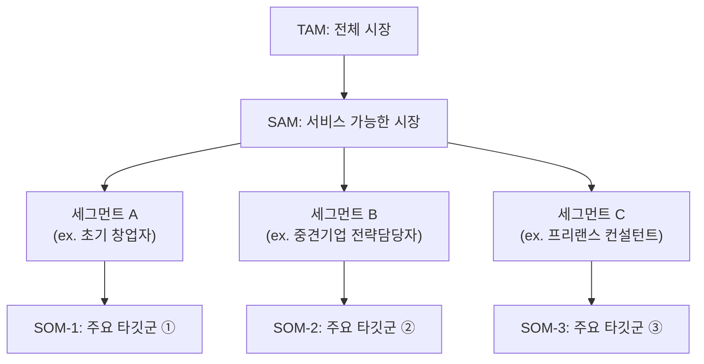
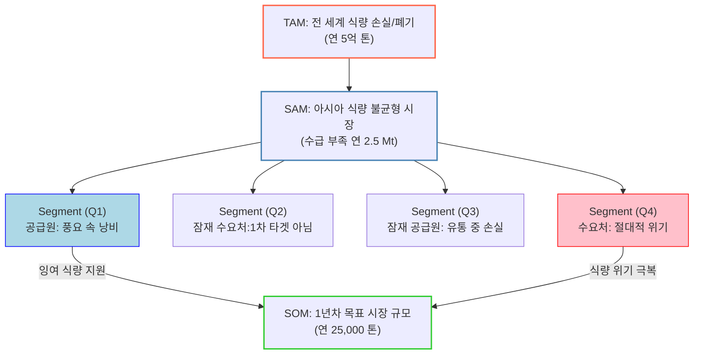

# 분석 방법론 — TAM-SAM-SOM 과 Market Segment Map

## Market Segment Map

> 시장을 단순 수치로 나누는 게 아니라, **'행동 단서'와 '구매 맥락'** 중심으로 시각화하는 지도

### TAM-SAM-SOM 과 시장 세그먼트의 관계 구조



---

## AI를 활용한 문제의식 기반의 `가설 수립 및 검토` 와 그에 따른 `시장 규모 산출`

> AI 리서치에서는 **문제의식만 확실하다면 그에 따른 솔루션 가설 검토에 집중**할 수 있습니다.
> 사람이 직접 **특정한 수치 계산에 매몰**되어 계속 계산해 가는 피곤한 방식으로 아이디어를 다듬을 필요가 없습니다.
>
> *실시간으로 AI 에게 **"`정성 & 정량 데이터 확인` · `글로벌 & 로컬 시장의 맥락 고려` · `다층적 사용자들의 행동`에 대한 교차분석"** 을 수행시키며 토론할 수 있기 때문입니다.*

### 문제의식을 비즈니스 계획으로 전환하는 7단계 워크플로우

### "문제의식 to 솔루션 7단계 전략"으로부터 시장 규모 TAM-SAM-SOM 과 Market Segment Map 이 추출되는 단계별 대응구조

> **문제의식 중심으로 워크플로우를 수행 시 다음과 같이 TAM-SAM-SOM 과 Market Segment Map 이 자연스럽게 도출됩니다.**



### Market Segment Map 시각화하기

> **매트릭스, 좌표평면, 밴다이어그램, 히트맵 등 다양한 방식 중 "내 비즈니스 아이디어에 가장 적절한 형태"를 적용**

```
"마켓 세그먼트를 이해하기 가장 쉽도록 표현할 수 있는 적절한 시각화 방향(매트릭스,
좌표평면, 밴다이어그램, 히스토그램, 히트맵 등 모든 방법 고려)을 찾아서 Mermaid 차트로 표현해줘"
```

---

## 본 실습에서의 적용 규칙

앞선 세 챕터와 **동일한 두 시장**에 이 프레임워크를 적용한다. 시장 규모는 숫자 자체가 결론이 되므로, 아래 규칙을 지켜야 문서가 의미를 갖는다.

### 1. 모든 수치에 근거 등급을 붙인다

| 표기 | 의미 | 다룰 때의 원칙 |
|---|---|---|
| **[검증]** | 공개 통계·기관 보고서·기업 공시에서 확인된 수치 | 출처를 문서 하단에 명시한다 |
| **[추정]** | 검증된 수치로부터 계산·환산한 값 | 계산식을 반드시 함께 보여준다 |
| **[가정]** | 근거 없이 설정한 값(침투율·전환율 등) | 값을 바꿔볼 수 있게 **가정임을 명시**하고, 민감도를 함께 적는다 |

> ⚠️ **가장 흔한 실패.** TAM-SAM-SOM은 큰 숫자를 만들기 쉬운 프레임워크다. 출처 없는 숫자로 채워진 TAM은 **틀린 것이 아니라 검증 불가능한 것**이며, 검증 불가능한 숫자는 의사결정에 쓸 수 없다. 본 실습에서는 **[가정] 값이 결론을 뒤집을 수 있는지**를 매번 확인한다.

### 2. Top-down 과 Bottom-up 을 함께 낸다

- **Top-down**: 산업 통계에서 시작해 조건을 걸어 좁혀 내려온다. 시장의 **천장**을 확인하는 데 쓴다.
- **Bottom-up**: 고객 1명이 만드는 금액에서 시작해 고객 수를 곱해 올라간다. 사업의 **현실성**을 확인하는 데 쓴다.
- 두 값이 크게 어긋나면 어느 한쪽의 가정이 틀렸다는 신호이므로, 어긋난 지점을 명시한다.

### 3. '자금 흐름'과 '매출'을 구분한다

플랫폼 사업에서 이 둘을 섞는 것이 TAM 과장의 최대 원인이다.

| 구분 | 시장 ①(라운드업) | 시장 ②(리세일) |
|---|---|---|
| 자금 흐름 규모 | 예치·편입되는 잔돈 총액 | 거래액(GMV) |
| **실제 매출** | 잔액에 부과하는 **관리보수·구독료** | 거래액에 부과하는 **수수료** |

> 📌 **왜 이 구분이 결정적인가.** 앞 챕터에서 시장 ②의 문제를 **"거래액과 이익이 비례하지 않는 구조"** 로 판정했다. 자금 흐름을 TAM으로 제시하면 이 문제가 숫자에서 사라져버린다. 본 실습은 **두 값을 모두 제시하고 그 격차를 결론으로 삼는다.**

### 4. Segment Map 의 축은 '행동 단서'로 잡는다

인구통계(연령·소득)만으로 축을 잡으면 세그먼트가 마케팅 대상 목록이 되고, 제품 의사결정에 쓰이지 않는다. 따라서 축은 **"이 사람이 어떤 상황에서 어떻게 행동하는가"** 로 잡는다.

| | 축으로 쓰면 약한 것 | 축으로 쓰면 강한 것 |
|---|---|---|
| 시장 ① | 연령, 월소득 | **소득의 안정성**, **금융 의사결정에 대한 자신감** |
| 시장 ② | 성별, 거주지 | **거래 1건의 금액대**, **위조 리스크에 대한 민감도** |

### 5. 앞 챕터의 결론을 세그먼트 우선순위 판정에 사용한다

Segment Map의 4분면 중 무엇을 SOM으로 삼을지는 취향이 아니라 **앞선 분석의 결론**으로 정한다.

| 앞 챕터의 결론 | 본 챕터에서의 사용 |
|---|---|
| Five Forces ② — *"저가 상품군에서 직거래 대체 위협이 가장 크다"* | 시장 ②의 **저가 세그먼트를 1차 타깃에서 제외** |
| KSF ① — *"라운드업은 입구, 수익은 상위 상품"* | 시장 ①의 SOM을 **1차 진입 세그먼트 + 사다리 도착 세그먼트로 분리** |
| KSF ② — *"전문 리셀러의 LTV가 압도적"* | 시장 ②의 **판매자 세그먼트를 별도 맵으로 분리** |

### 6. 산출물

| 산출물 | 파일 |
|---|---|
| 시장 ① TAM-SAM-SOM + Segment Map | `분석-01-라운드업-자동저축-소액투자.md` |
| 시장 ② TAM-SAM-SOM + Segment Map | `분석-02-한정판-리세일-정품검수-플랫폼.md` |
| 두 시장 비교 | `비교분석-라운드업저축-vs-리세일플랫폼.md` |

> 📎 **교안 원문 관련 메모.** 위 "문제의식을 비즈니스 계획으로 전환하는 7단계 워크플로우" 절의 단계별 상세는 교안 본문에 별도로 제시된다. 본 문서에는 교안이 함께 제시한 **단계별 대응구조 다이어그램**만 수록했으며, 그 아래 "본 실습에서의 적용 규칙"은 이 프레임워크를 우리 두 시장에 적용하기 위해 추가한 절이다.
