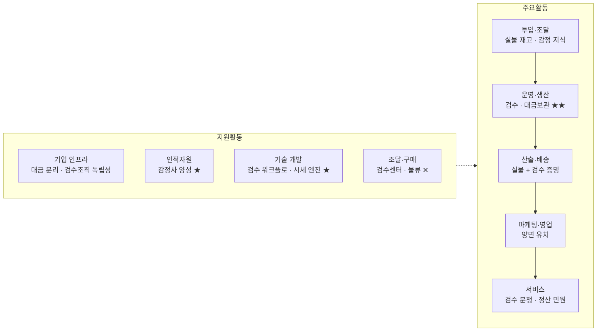

# 가치사슬 분석 ② — 정품검수 기반 한정판 스니커즈·명품 리세일 C2C 플랫폼

> [분석 방법론](./가치사슬-분석-방법론.md) · 선행 분석 [Five Forces ②](./02-한정판-리세일-정품검수-플랫폼-포터5힘-분석.md)

## 0. 분석 단위와 방법론 적용 방식

| 항목 | 설정 |
|---|---|
| 분석 주체 | 상품을 물리적으로 받아 **정품 검수 후 전달하고 대금을 보관·정산하는 C2C 플랫폼 사업자** |
| 거래 대상 | 발매 즉시 품절되어 정가 이상으로 재거래되는 한정판 스니커즈, 시즌 한정 명품 잡화 |
| 수익 모델 | 거래 수수료 중심, 일부 검수·보관 서비스·시세 데이터 |
| 지역·시점 | 국내, 2026년 현재 |

> 📎 **방법론 적용 메모.** 방법론의 질문표는 금융 플랫폼 기준으로 쓰여 있으므로, 이 산업의 언어로 번역해 답한다. 핵심은 **"이 사업의 투입물이 데이터가 아니라 실물과 사람의 판단"**이라는 점이다.

| 질문표의 금융 용어 | 본 분석에서의 대응 개념 |
|---|---|
| 고객 동의 기반 금융데이터 | 정품 판별 데이터베이스, 체결 시세 데이터 |
| 은행·카드사·증권사 연결 | 판매자 공급망, 물류사, PG·에스크로 |
| 금융거래 처리 | **검수 공정 + 대금 보관·정산 처리** |
| 이상거래 탐지 | 위조품 탐지, 시세 조작·어뷰징 탐지 |
| 전자금융업·금융상품 중개 라이선스 | 통신판매중개업 신고, 판매대금 보관·정산 관련 규제 |

### 전체 가치사슬 개요



★ = 차별화가 만들어지는 활동 · ★★ = **사업의 심장** · ✕ = 실행 주체가 외부인 활동

> 📌 **개요에서 이미 드러나는 것.** 9개 활동 중 7개가 내부 수행이고, **가장 중요한 활동(검수)이 완전히 내부에 있다.** ①번 시장과 정반대 구조다. 다만 그 심장이 사람과 공간에 묶여 있다는 점이 뒤에서 문제가 된다.

---

## 1. 주요활동 분석

### 1-1. 투입·조달 물류 (Inbound Logistics)
**실물 재고·감정 지식·검수 역량 확보**

| 가치사슬 **설계**를 위한 질문 🏗️ | 가치사슬 **개선**을 위한 질문 🚀 |
| --- | --- |
| • 핵심 투입자원은 무엇인가? → **판매자의 실물 재고, 정품 판별 지식(감정 기준·위조 사례 DB), 감정 인력, 검수센터·물류, 체결 시세 데이터, 대금 보관 수단**<br>• → **투입물이 API가 아니라 물건·공간·숙련도**라는 점이 이 사업의 성격을 규정한다<br>• 판매자를 어떻게 확보할 것인가? → 개인 판매자(다수·소액)와 전문 리셀러(소수·대량)를 **다른 정책으로** 유치. 리셀러는 정산 주기와 수수료율로, 개인은 판매 편의성으로 움직인다<br>• 무엇을 자체 확보하고 무엇을 외부에서 살 것인가? → **감정 기준·위조 사례 DB·검수 워크플로·시세 데이터는 자체**(유일한 방어 자산). 물류·결제·창고 설비·포장재는 외부<br>• 검수센터를 직영할 것인가 외주할 것인가? → **초기 최대 결정.** 직영은 CAPEX와 고정비를 지지만 품질과 데이터를 내부화한다. 외주는 빠르지만 **핵심 방어 자산을 남에게 맡기는 결과**<br>• 판매자가 참여할 유인은 무엇인가? → 확실한 판매와 빠른 정산 | • 외부 데이터의 정확성·최신성을 어떻게 높일 것인가? → **감정 기준은 위조 기술 발전에 따라 계속 낡는다.** 불합격 사례를 구조화해 기준에 환류시키는 절차가 없으면 검수 품질은 시간이 갈수록 떨어진다<br>• 특정 공급자 의존도를 줄일 수 있는가? → 단일 물류사·단일 PG 의존은 성수기 병목과 정산 리스크로 직결<br>• **장애 대체 경로가 있는가?** → 검수센터 한 곳이 멈추면 전체 거래가 멈춘다. **API 장애보다 회복이 느린 종류의 장애**이므로 거점 이중화가 사업 연속성의 조건<br>• 데이터를 어떻게 되먹일 것인가? → (a) 위조 위험 판매자 사전 식별 (b) 카테고리별 검수 소요시간 예측 (c) 시세 신뢰도 산출<br>• 상위 판매자 소수에 물량이 편중되어 있지 않은가?<br>• 판매자 정보 중복 수집을 줄일 수 있는가? → **거래 이력 기반 신뢰 등급**으로 저위험 거래의 검수 강도를 낮출 수 있다 |

> 📌 **Five Forces 연결.** ②번 분석에서 공급자 교섭력을 '중간'으로 판정한 근거가 이 활동에서 확인된다. 개별 판매자는 대체 가능해 약하지만, **대량 리셀러와 숙련 감정사는 강하다.** 다만 이들은 정산 조건과 인사 정책으로 **플랫폼이 관리할 수 있는 범위** 안에 있다.

> 📊 **측정 지표.** 신규 판매자 유입수 · 리스팅 수 · 검수 기준 갱신 주기 · 물류사 집중도 · 거점 가동률

### 1-2. 운영·생산 (Operations)
**검수와 대금 보관 — 이 사업의 심장이자 최대 원가**

```
입찰/즉시구매 → 결제 승인(대금 보관 시작) → 판매자 발송 → 검수센터 입고
  → 검수(정품 판별·상태 등급) → [합격] 구매자 배송 → 인수 확인 → 판매자 정산
                              → [불합격] 판매자 반송 → 구매자 환불 → 판매자 제재
```

| 설계 🏗️ | 개선 🚀 |
| --- | --- |
| • 고객 요청을 실제 가치로 바꾸는 핵심 처리는? → 위 흐름. **이 사업이 파는 것은 상품이 아니라 검수다.** 따라서 운영은 부수 업무가 아니라 **제품 그 자체**<br>• 검수 범위를 어떻게 정할 것인가? → 전 카테고리 전수검수는 원가가 폭증하고, 고가만 검수하면 저가 거래의 신뢰가 무너진다. → **금액·판매자 신뢰등급·카테고리 위조율에 따른 차등 검수**<br>• **대금 보관 구조를 어떻게 설계할 것인가?** → 언제부터 언제까지 누가 보관하고 정산은 어느 시점에 실행되는지가 사고 시 책임 구조를 결정한다. **판매대금을 운영자금과 섞는 구조는 정산 지연 사고의 직접 원인**이므로 자금 분리가 필수<br>• 이상거래 탐지는? → 자기 거래를 통한 **시세 조작**, 대량 취소, 미발송 반복이 이 시장의 이상거래. 자동 탐지 룰과 제재 정책이 함께 있어야 한다<br>• 거래량이 급증해도 처리할 수 있는가? → 검수 처리량은 사람 수에 묶여 있어 **트래픽 급증이 곧 검수 적체**로 나타난다. 예약 입고·우선순위 큐로 흡수<br>• 자동화와 사람 검수의 경계는? → 판단은 사람, 스크리닝과 배정은 자동 | • **검수 소요일 단축이 최대 개선 레버다.** → 검수 기간은 (a) 구매자 불안 (b) 판매자 정산 지연 (c) 시세 변동 리스크를 모두 발생시킨다. 입고 예약 + 사전 사진 판독으로 명백한 위조를 미리 걸러 큐 부하 감소<br>• 부분 자동화의 목표는? → 이미지 판독 모델은 감정사를 대체할 수 없지만 **1차 스크리닝과 우선순위 배정**에는 유효하다. 자동화가 향하는 목표는 판단 대체가 아니라 **감정사 시간의 재배치**<br>• **오탐과 미탐 중 무엇을 우선할 것인가?** → 정품을 불합격 처리하면(오탐) 판매자가 이탈하고, 위조품을 통과시키면(미탐) 플랫폼 신뢰가 붕괴한다. **미탐 비용이 압도적으로 크므로 임계값은 보수적으로**, 그로 인한 오탐은 재심 절차로 구제<br>• 정산·대사를 자동화할 수 있는가? → 대금 보관 → 정산 → 수수료 차감의 대사 자동화로 정산 오류 제거<br>• 검수 결과를 재활용할 수 있는가? → 검수 이력을 상품에 귀속시켜 **재판매 시 간이 확인**으로 처리 |

> ⚠️ **이 사업 특유의 부담.** 검수는 자동화가 어려운 **사람 중심 공정**이다. 거래가 2배 늘면 검수 원가도 대체로 함께 늘어난다. 즉 **플랫폼 사업의 전형적 장점(한계비용 0 수렴)을 이 활동에서는 누리지 못한다.** 규모의 경제가 나타나는 곳은 검수 자체가 아니라 ⓐ물류 단가 협상 ⓑ시세 데이터의 가치 ⓒ축적된 감정 지식 세 곳뿐이며, **이 세 곳을 얼마나 키우느냐가 이익률을 결정한다.**

> 📊 **측정 지표.** **검수 소요시간(입고→판정)** · 불합격률 · **미탐 사고 건수** · 검수 건당 원가 · 정산 지연율 · 취소·미발송률

### 1-3. 산출·배송 물류 (Outbound Logistics)
**실물 + 검수 증명 + 거래 상태 정보**

| 설계 🏗️ | 개선 🚀 |
| --- | --- |
| • 고객은 무엇을 전달받는가? → **실물 상품 + 검수 결과의 증명 + 거래 상태 정보** 세 가지. 셋 중 하나만 빠져도 신뢰가 완성되지 않는다<br>• 어떤 형식으로 보여줄 것인가? → **상태 추적이 핵심 UX다.** 결제부터 수령까지 며칠이 걸리므로 고객은 그 기간 내내 "내 물건이 어디 있나"를 확인한다. 단계별 상태(발송 대기 / 입고 / 검수 중 / 합격 / 배송 중)를 명시적으로 노출<br>• 검수 증명 형식은? → 인증 태그, 검수 리포트, 상태 등급 사진. **눈에 보이는 증명물이 수수료의 정당성을 만든다**<br>• 채널 역할 구분 → 앱=상태, 푸시=단계 전환, 이메일=정산 명세<br>• 판매자·파트너에게 필요한 정보는? → 정산 예정일, 수수료 내역, 불합격 사유 | • **지연 시 안내가 신뢰를 지키는 유일한 수단이다.** → 검수 적체는 반드시 발생하므로, 예상 완료 시점과 지연 사유를 선제적으로 알리는 것이 민원을 크게 줄인다<br>• 정보 우선순위가 명확한가? → 시세 그래프보다 **현재 거래 상태**가 상단에<br>• 비교 가능한 형태로 제공하는가? → 동일 모델의 사이즈·상태별 시세를 한 화면에서 비교하게 만드는 것이 구매 전환의 핵심<br>• **중복·과도한 알림을 줄일 수 있는가?** → 단계마다 푸시를 보내면 피로해진다. **판정·배송 시작·정산 완료의 3개 이벤트만** 즉시 알림<br>• 불합격 통지의 톤은? → 판매자에게 제재 통보가 아니라 **사유 설명**으로 전달되어야 재거래로 이어진다 |

> 📌 **여기가 B의 이익률 개선 지점.** 실물 배송은 건당 물류비가 발생해 규모의 경제가 제한된다. 반면 **"검수 증명"이라는 무형 산출물은 복제 비용이 0**이다. 따라서 개선의 방향은 실물이 아니라 **증명의 상품화**(인증서·검수 리포트·정품 이력 데이터)다.

> 📊 **측정 지표.** 상태 조회 진입률 · 지연 사전안내율 · 배송 완료 소요일 · 알림 차단율

### 1-4. 마케팅 및 영업 (Marketing & Sales)

| 설계 🏗️ | 개선 🚀 |
| --- | --- |
| • 핵심 고객은 누구인가? → **양면 시장이므로 마케팅이 두 개다.** 구매자에게는 "가짜 걱정 없이 산다", 판매자에게는 "빠른 정산과 확실한 판매". 두 메시지의 자원 배분이 곧 전략<br>• 고객이 이 플랫폼을 써야 하는 핵심 이유는? → 편의가 아니라 **위조·사기 리스크의 제거**. ①번 시장과 결정적으로 다른 점은 **고객이 돈을 낼 이유가 이미 명확하다**는 것<br>• 채널 역할은? → 발매 이슈 트래픽, 스니커·명품 커뮤니티, 검색(모델명), 시세 콘텐츠. **시세 데이터 자체가 강력한 유입 자산**<br>• 신뢰·안전을 어떻게 전달할 것인가? → 검수 과정의 가시화, 보상 정책의 사전 공표<br>• 수수료 정책은? → **마케팅 수단이 아니라 제품 정책으로 다뤄야 한다**(아래 참조) | • **수수료 무료 프로모션의 함정을 어떻게 피할 것인가?** → 무료로 시작하면 시장이 그 가격을 기준점으로 학습하고 정상화 시점에 이탈이 발생한다. → 무료 대신 **검수 무료 횟수, 신규 판매자 정산 우대**처럼 **되돌리기 쉬운 형태**의 유인 사용<br>• CAC를 낮추고 LTV를 높일 수 있는가? → 재거래 빈도가 높은 **전문 리셀러의 LTV가 압도적**이므로 획득 자원을 이 세그먼트에 우선 배분<br>• 교차 이용률을 어떻게 높일 것인가? → 스니커즈→명품, 그리고 **구매자→판매자 전환이 이 사업 최고의 성장 레버**<br>• 이해상충을 어떻게 관리할 것인가? → 시세 데이터 제공자와 거래 중개자를 겸하므로, 시세 표시가 거래를 유도하는 방향으로 왜곡되지 않아야 한다<br>• 바이럴이 장기 고객으로 이어지는가? → 커뮤니티는 가장 저렴한 채널이지만 **사고 발생 시 같은 속도로 역풍**이 된다 |

> 📊 **측정 지표.** CAC(구매자/판매자 별도) · 재거래율 · **구매자→판매자 전환율** · 카테고리 교차 이용률 · 수수료 인상 후 이탈률

### 1-5. 서비스 (Service)
**거래 이후 지원과 사용자 보호**

| 설계 🏗️ | 개선 🚀 |
| --- | --- |
| • 어떤 문제를 처리해야 하는가? → **검수 지연, 불합격 이의, 상태 등급 분쟁, 배송 파손·분실, 정산 지연, 위조품 통과 사고**<br>• **위조품 통과 사고 대응이 최종 방어선이다.** → 보상 정책(전액 환불 + 추가 보상), 조사 절차, 재발 방지(감정 기준 갱신)를 **사전에 공표해 두는 것 자체가 신뢰 자산**<br>• 고객이 스스로 해결할 수 있는 기능은? → 상태 조회, 반송 신청, 이의 제기, 정산 명세 확인<br>• 자동 처리와 사람 검수의 경계는? → 상태·정산 문의는 자동, **검수 판정 관련 분쟁은 반드시 사람.** 판정은 사업의 신뢰 근거이므로 자동응답으로 다룰 수 없다<br>• 판매자·파트너 지원은? → 정산 명세 API, 대량 리스팅 도구, 불합격 사유 통계 | • 반복 문의를 제품으로 제거할 수 있는가? → "검수 언제 끝나나요"는 예상 완료일을 화면에 표시하면 사라진다. **이 사업 문의량의 큰 부분이 여기서 발생**<br>• 문의 전에 탐지할 수 있는가? → 검수·배송 지연은 시스템이 먼저 안다<br>• **AI 상담이 정품 여부를 언급하지 않도록 통제하는가?** → 잘못된 확언이 곧 법적 리스크<br>• 처리시간이 아니라 무엇을 볼 것인가? → **분쟁 해결률과 재문의율**<br>• 신고·민원 원인을 분류할 수 있는가? → 검수 기준 / 물류 / 정산 / UX / 정책. 특히 **불합격 이의가 반복되는 모델은 감정 기준 재검토 신호** |

> 📌 다른 산업에서 '서비스'는 부수 활동이지만, 이 사업에서 서비스는 **유일한 방어 자산을 지키는 활동**이다. 위조품 통과 한 건이 오래 쌓은 검수 신뢰를 무너뜨리므로, 사고 대응의 품질이 곧 사업의 생존 조건이다.

> 📊 **측정 지표.** 문의율 · 분쟁 해결률 · 이의 제기 인정률 · **위조 사고 건수** · 재문의율

---

## 2. 지원활동 분석

| 활동 | 설계 🏗️ | 개선 🚀 |
| --- | --- | --- |
| **기업 인프라**<br>Firm Infrastructure | • 금융 라이선스는 불필요하지만 **판매대금을 보관·정산한다는 사실 자체가 규제 관심 영역**이다. 통신판매중개업 신고, 전자상거래 표시·광고 의무, **판매대금의 별도 관리와 정산 투명성**이 핵심 준수 사항<br>• 조직 설계 → **검수 품질을 판정하는 조직이 영업·성장 조직으로부터 독립되어 있어야 한다.** 거래량 압박이 검수 강도를 낮추는 경로를 차단하는 것이 지배구조의 핵심<br>• 신규 카테고리 확장 시 검토 → 해당 카테고리의 위조율·감정 난이도·법적 이슈(병행수입, 상표권) 사전 평가 | • **성장지표와 품질지표가 충돌할 때 무엇을 우선하는가?** → "성수기 검수 속도를 위해 기준을 완화하자"는 요구는 반드시 발생한다. **미탐 1건의 비용이 처리량 증가 이익보다 크다는 원칙**을 사전 합의<br>• 판매대금과 운영자금의 분리 상태를 정기 점검하는가? → **정산 지연은 재무 문제가 아니라 신뢰 사고로 분류**해야 한다<br>• 위조 사고 시 지휘체계(공지·보상·조사·기준 개정)가 단일한가?<br>• 카테고리·거점 확장에 따라 책임이 분산되고 있지 않은가? |
| **인적자원 관리**<br>HRM | • 필요 인재: **감정사(핵심)**, 검수 운영 관리자, 물류 운영, 데이터 분석, 제품·개발<br>• **감정 역량은 채용으로 즉시 조달되지 않는다.** 시장의 숙련 감정사 풀 자체가 작으므로 **내부 양성 체계가 곧 진입장벽**<br>• 판정 권한과 최종 책임의 소재 → 이견이 있을 때 누가 결정하는가를 명문화<br>• 검수 윤리 내재화 → 판정이 거래 상대에게 미치는 금전적 영향이 크므로 청탁·유착 방지 절차 필요 | • **지식이 개인에게 종속되어 있지 않은가?** → 특정 감정사만 판별 가능한 모델이 있다면 그 사람의 부재가 곧 서비스 중단이다. 판별 포인트의 문서화·이미지화가 인적 리스크 분산이며 **동시에 자동화의 학습 데이터**가 된다<br>• 성과평가가 무엇을 반영하는가? → 처리량만 평가하면 미탐이 늘어난다. **판정 정확도(사후 이의 인정률)** 포함 필수<br>• 번아웃을 관리하는가? → 발매 이슈에 따라 물량이 급변하므로 인력 유연성 확보<br>• 감정사 등급·경력 체계로 이탈률을 낮추는 것이 검수 품질 유지의 근본 대책 |
| **기술 개발**<br>Technology Development | • **경쟁력을 만드는 기술은?** → (a) 입찰·즉시구매 매칭 엔진 (b) **검수 워크플로 시스템** (c) 시세 산출 엔진 (d) 대금 보관·정산 원장 (e) 이미지 1차 판독 모델<br>• 자체 vs 외부 → **검수 워크플로와 시세 엔진은 반드시 자체**(차별화 자산), 물류 추적·결제·알림은 외부<br>• 기술자산 관리 → 검수 결과·판별 포인트·불합격 사유를 **구조화된 데이터로** 관리. 텍스트 메모로 남기면 자산이 되지 않는다<br>• AI 적용 우선순위 → 1차 스크리닝 > 어뷰징·시세조작 탐지 > 시세 예측 > 상담 보조 | • 중복 개발을 줄일 수 있는가? → 카테고리별로 검수 시스템을 따로 만들지 않도록 **공통 워크플로 엔진화**<br>• 장애를 사전에 예측할 수 있는가? → 성수기 처리량 예측으로 인력·거점 사전 배치(이 사업의 '장애 예측' 버전)<br>• **모델의 편향을 관리하는가?** → 특정 브랜드·색상에서 불합격률이 비정상적으로 높다면 모델 또는 기준의 편향 신호<br>• 생성형 AI가 **정품 여부를 확언하지 않도록** 출력 게이트 필수<br>• API 변경 시 판매자 도구 호환성을 유지하는가? |
| **조달·구매**<br>Procurement | • 조달 항목: 검수센터 임차·설비, 물류(집하·배송), PG·정산 대행, 포장재, 클라우드, 고객센터<br>• **조달의 성격이 ①번 시장과 다르다.** A는 건당 과금 API를 조달했지만 이 사업은 **공간·운송·인력**을 조달한다. 물리적이라 **변경에 시간이 오래 걸린다**<br>• 공급자 평가에 **성수기 처리 능력(피크 캐파)** 반드시 포함. 평시 단가만 보고 선정하면 성수기에 무너진다<br>• 공급자 장애·계약 종료 시 대체 경로 확보 | • **거래량 증가에 따른 배송 단가 인하 협상이 직접적인 이익률 개선이다.** 물류비는 이 사업의 주요 변동비<br>• 단일 물류사·단일 PG 종속을 해소했는가?<br>• 계약에 성수기 SLA와 미달 시 조치 조항이 있는가?<br>• 검수센터 확장은 **되돌리기 어려운 고정비 결정**이므로, 거래량 예측 정확도가 곧 조달 리스크 관리다 |

---

## 3. 종합 진단 — 가치는 어디서 만들어지고 어디서 새는가

| 구간 | 판정 | 근거 |
|---|---|---|
| 투입·조달 | 🟡 중립 | 판매자 유치는 비용이나, 감정 지식은 축적되는 자산 |
| 운영·생산 | 🟢 **가치 창출** *(동시에 최대 원가)* | 검수가 곧 제품. 완전히 내부 통제. 단 사람 공정이라 원가가 거래량에 비례 |
| 산출·배송 | 🟡 중립 | 실물 물류비는 원가, **증명은 자산화 여지** |
| 마케팅·영업 | 🟡 중립 | 지불 이유가 명확해 ①번보다 유리. 단 수수료 프로모션이 함정 |
| 서비스 | 🔴 **비용 중심** *(단 방어선)* | 매출로 연결되지 않지만 유일한 방어 자산을 지키는 활동 |
| *(지원)* 인적자원 | 🟢 **가치 창출** | 감정 역량 = 돈으로 살 수 없는 진입장벽 |
| *(지원)* 조달·구매 | 🔴 **가치 유출** | 검수센터 고정비 + 물류비가 이익률을 직접 압박 |

**핵심 진단 세 가지**

1. **가치사슬의 중심이 내부에 있다.** 9개 활동 중 7개를 직접 수행하며, **가장 중요한 활동(검수)이 완전히 내부에 있다.** 이것이 Five Forces에서 공급자 교섭력을 '중간'으로 판정한 활동적 근거이자, **수익성 상한을 스스로 끌어올릴 수 있는 이유**다. 검수 품질을 높여 수수료를 정당화하는 판단에 **누구의 승인도 필요하지 않다.**

2. **그러나 그 중심이 사람과 공간이라 규모의 경제가 약하게 작동한다.** 거래가 2배가 되면 검수 원가도 함께 늘어난다. 규모의 경제가 나타나는 곳은 검수 자체가 아니라 **물류 단가 협상, 시세 데이터의 가치, 축적된 감정 지식** 세 곳뿐이다. 이 사업의 이익률은 **이 세 곳을 얼마나 키우는가**로 결정된다.

3. **유일한 방어 자산이 비대칭적으로 취약하다.** 검수 신뢰는 무사고 거래를 오래 쌓아야 생기지만 **한 번의 미탐으로 크게 훼손된다.** 따라서 가장 중요한 관리 지점은 성장 활동이 아니라 **검수 조직의 독립성과 판정 정확도**이며, 역설적으로 **비용 중심으로 분류한 서비스 활동에 방어선이 있다.**

## 4. 개선 우선순위

| 순위 | 활동 | 조치 | 근거 |
|---|---|---|---|
| 1 | 운영·생산 | **검수 소요시간 단축**(예약 입고 + 1차 스크리닝) | 구매 전환·정산 지연·민원을 한 번에 개선 |
| 2 | 인적자원 / 기술 개발 | **판별 지식의 문서화·데이터화** | 인적 리스크 분산 + 자동화 학습 데이터. **진입장벽을 사람에서 자산으로 옮긴다** |
| 3 | 기업 인프라 | 판매대금 분리·정산 준수율 관리 | 정산 지연 = 신뢰 붕괴 직결 |
| 4 | 산출·배송 | **검수를 증명물로 상품화**(인증·리포트·이력 데이터) | 복제 비용 0인 산출물로 전환. 수수료 인상의 명분 |
| 5 | 조달·구매 | 물류 단가 협상 + 복수 물류사 확보 | 주요 변동비 절감과 성수기 병목 해소 |
| 6 | 마케팅·영업 | 구매자→판매자 전환 설계 | LTV 개선의 최대 레버 |

> Five Forces가 내린 결론(**검수 신뢰를 상품화하는 "신뢰 상품화형" 전략**)을 가치사슬로 옮기면, 실행은 **운영 활동의 처리속도 개선 + 감정 지식의 자산화 + 산출 활동에서의 증명 상품화**로 구체화된다. 이 사업의 문제는 사슬이 짧은 것이 아니라 **중심 활동이 사람과 공간에 묶여 규모의 경제를 못 누린다**는 데 있다.
